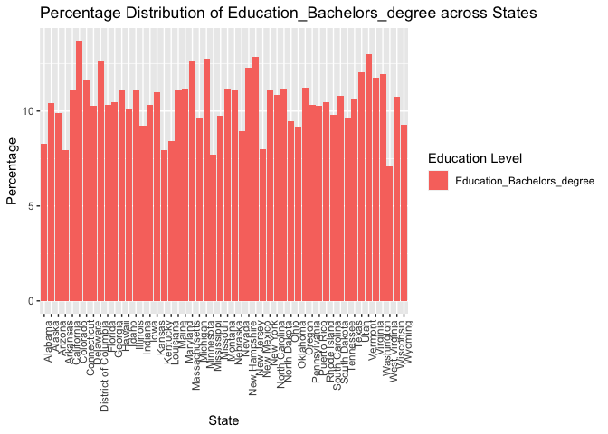
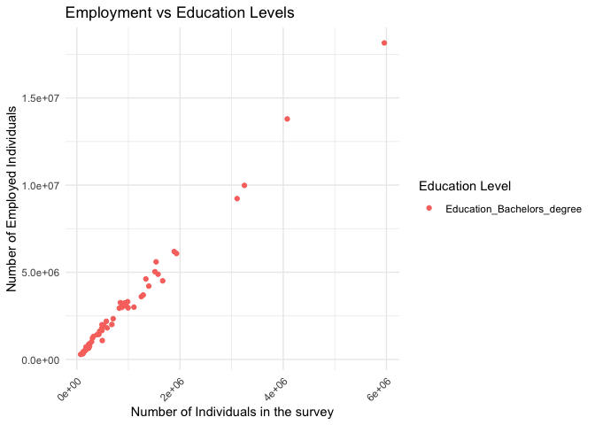

DS 202 Final Project Report
================
Abhay, Srika, Neha, Esha, Niharika
2023-11-12

------------------------------------------------------------------------

# <u>Part 1</u>

#### “Socio-Economic Factors Influencing Employment in the United States: A Comprehensive State-by-State Analysis”

## **Authors**

1.  Abhay Prasanna Rao

2.  Srika Raja

3.  Neha

4.  Esha

5.  Niharika

## **Abstract (TL;DR)**

This project investigates the impact of socio-economic factors on
employment rates across U.S. states. Utilizing ACS 2021 data, we explore
relationships between employment and variables like education,
citizenship, and housing. Key findings include significant correlations
that inform employment dynamics in the U.S.

## **Motivation**

We aim to analyze various socio-economic factors influencing employment
in the U.S. This study is crucial for understanding how different
aspects like education, age, and housing contribute to employment rates,
thereby aiding policymakers and researchers.

## Summary

We have imported data set from the ACS survey. We have 6 child RMD files
for this project which has the data analysis for the Employment,
Education, Citizenship, Age, Housing, Disabilities Data Set (ACS
2021).  
Further, we started exploring each data set in detail and then we
started combining each data set with the employment to see what results
we can expect. We did find many direct relationships with each data set
on employment data set. We have put our concluding results in the Final
Report to help us stand by with our conclusions.

# <u>Part 2:</u>

## Data Sets and Variables

The below data sets are from data.census.gov \[ United States Census
Bureau\]. We shortlisted it based on ACS 2021, inclusive for all states
in United States.

1.  <u>Employment - K202301</u>

    | Variable              | Description                          |
    |-----------------------|--------------------------------------|
    | Total                 | Total Employment Data                |
    | In Labor Force        | Total People in Labor Force          |
    | Civilian labor force: | Total People in Civilian Labor Force |
    | Employed              | Total People Employed                |
    | Unemployed            | Total People Unemployed              |
    | In Armed Forces       | Total People in Armed Forces         |
    | Not in labor force    | Total People not in Labor Force      |

2.  <u>Education - K201501</u>

    | Variable                               | Description                                                                  |
    |----------------------------------------|------------------------------------------------------------------------------|
    | Education_Total_students               | Total Students in the Education Survery                                      |
    | Education_Below_9th grade              | Number of students who have completed 9th grade                              |
    | Education_9th to 12th grade_no diploma | Number of students who have completed 9th grade to 12th grade but no diploma |
    | Education_High_school_graduate         | Number of high school graduate students                                      |
    | Education_Some college_no degree       | Number of people enrolled into some college but have not acquired a degree   |
    | Education_Associates_degree            | Number of people with associates degree                                      |
    | Education_Bachelors_degree             | Number of people with bachelors degree                                       |
    | Education_Graduate_professional degree | Number of people with Graduate Degree                                        |

3.  <u>Citizenship - K200501</u>

    | Variable           | Description                              |
    |--------------------|------------------------------------------|
    | Total              | Total Number of people in survey         |
    | U.S. citizen       | Number of US citizen in the survery      |
    | Not a U.S. citizen | Number of Non US Citizens in the survery |

4.  <u>Age - K200104</u>

    | Variable      | Description                                  |
    |---------------|----------------------------------------------|
    | Total_age     | Total number of people in the age data frame |
    | Age_under_18  | Total number of under 18 people              |
    | “Age_18_to_24 | People between 18 to 24                      |
    | Age_25_to_34  | People between 25 to 34                      |
    | Age_35_to_44  | People between 35 to 44                      |
    | Age_45_to_54  | People between 45 to 54                      |
    | Age_55_to_64  | People between 55 to 64                      |
    | Age_over_64   | People over 64                               |

5.  <u>Housing - K202502</u>

    | Variable        | Description                                    |
    |-----------------|------------------------------------------------|
    | Total           | Total Number of People in housing data frame   |
    | Owner Occupied  | Total Number of people who have their own home |
    | Renter Occupied | Total Number of people who are renting a place |

6.  <u>Disabilities - K201803</u>

    | Variable                | Description                     |
    |-------------------------|---------------------------------|
    | Total_people            | Total Poeple in the data frame  |
    | Total With Disabilities | Total with disabilities         |
    | Hearing                 | Total with hearing problem      |
    | Vision difficulty       | Total with vision problem       |
    | cognative               | Total with cognative problem    |
    | ambulatory difficulty   | Total with ambulatory difficlty |
    | Self-care difficulty    | Total with self care difficulty |
    | No Disability           | Total without disabilities      |

## Employment

<!-- -->

<u>Interpretations:</u>  
High Employment States: The states at the far left, such as Nebraska,
Minnesota, and Iowa, show the highest employment rates, each appearing
to exceed 60%. Low Employment States: On the right side, Puerto Rico,
West Virginia, and Mississippi have the lowest employment rates
depicted, with Puerto Rico showing a rate significantly lower than all
states, possibly below 40%. Variability: The chart shows that there is a
significant variability in employment rates across different states and
territories. This could be due to a variety of factors such as economic
policies, industrial diversity, population demographics, and educational
attainment levels.

<!-- -->

The above bar chart shows the number of people who are employed, in
armed forces or unemployed for each state. We can observe that bigger
cities like california, new york, texas etc have the highest number of
people who are employed. We can also notice that unemployment while
compared to employment is less in each city.

<!-- -->

The above graph shows the unployment rates across different states. We
can observe that most number of states have an unemployment rate between
1-4.5%

<!-- -->

<!-- -->

------------------------------------------------------------------------

The above chart shows the distribution of employment rates in the form
of a map of the united states for better visualization. We can see that
states like UT,NE,MN have the highest employment rates.

------------------------------------------------------------------------

## Education

As a data science student, I’m captivated by how education influences
economic and societal progress. My analysis focuses on how higher
education correlates with improved job prospects and financial
stability. With the wealth of educational data available for
longitudinal study, I’m keen to understand and potentially shape
educational policy. I’m especially interested in how education imparts
essential skills for the modern workforce and promotes adaptability in a
tech-driven world. Ultimately, my work delves into education’s role in
fostering individual growth and its potential to drive societal change.

**Exploratory Data Analysis (EDA)** based on percentage

<!-- --><!-- --><!-- --><!-- --><!-- --><!-- --><!-- --><!-- -->

<!-- --> **Inference
for the above garph**

The bar chart depict the distribution of educational attainment by
state, represented as a percentage of the total population within each
state. From the graph, we can infer that certain states have a higher
percentage of individuals with specific levels of education for instance
the states with larger populations, such as California, Texas, Florida,
and New York, exhibit the highest numbers in educational attainment
across all levels, from below 9th grade to graduate or professional
degrees. This suggests a diverse educational demand and a corresponding
supply of educational institutions and job opportunities that require
various levels of education. California stands out with the highest
numbers in every category, reflecting its vast and diverse educational
landscape. While the prevalence of higher education degrees in states
like Illinois denotes a strong higher education system, the significant
figures for those with less than a high school diploma highlight ongoing
challenges in educational access and retention in these heavily
populated states.

<!-- -->
<!-- -->
<!-- -->

**Inference for above Three Graphs**

The above three bar charts illustrate the distribution of various
education levels across different states. The first chart likely
represents the percentage of the population with a bachelor’s degree,
showing a gradual increase in educational attainment towards District of
columbia states. The second chart appears to show the distribution of
master’s degrees, which, while following a similar pattern, reflects
lower percentages indicative of the reduced number of individuals who
pursue postgraduate education. The third chart, presumably depicting
high school diploma holders, presents a more pronounced variability,
culminating in a steep increase for the last few states. This suggests a
greater disparity in high school graduation rates across states.
Generally, states with higher percentages of bachelor’s and master’s
degree holders also have a high percentage of high school diploma
holders, indicating possible correlations between state education
policies and the value placed on education.

------------------------------------------------------------------------

------------------------------------------------------------------------

## Citizenship

Citizenship status significantly influences employment prospects, with
non-citizens often facing unique challenges in the job market. Legal
restrictions and specific job requirements tied to citizenship can limit
access to certain professions, hindering career opportunities and
advancement for non-citizens. Employers may encounter administrative
complexities when hiring individuals without citizenship, potentially
impacting their hiring decisions. Discrimination based on immigration
status can further exacerbate challenges for non-citizens in securing
meaningful employment. Balancing national security considerations with
the principles of equal employment opportunities is crucial to fostering
inclusive workplaces that recognize and harness the skills and
contributions of individuals, irrespective of their citizenship status.
Efforts to promote fair employment policies and combat biases contribute
to creating a more equitable job market for all.

<!-- --><!-- --><!-- -->
The ratio of US Citizens vs Non-US Citizens varies greatly across
various states in the U.S. as you can observe from the graph above.In
general there is a trend observed that , states with lesser US citizens
have a lower employment rate.

## Age

Age is one of the important social factor which affects the job market.
Employers may discriminate against older workers, believing them to be
less productive, adaptable, or tech-savvy. This can lead to age bias in
hiring and promotion practices, affecting older workers’ job
opportunities.Younger workers may be willing to accept lower wages than
older workers, making them more cost-effective for employers.
Contradistinction in some fields older workers often have decades of
experience and accumulated wisdom in their field, making them valuable
assets to any team. They may have a deeper understanding of industry
trends, protocols, and best practices, leading to better problem-solving
and decision-making skills. Due to their experience and expertise, older
workers may require less training than younger colleagues, saving
employers time and resources.

<script type="application/json" data-for="htmlwidget-e0396e25882bf7a79f65">{"x":{"data":[{"orientation":"v","width":[0.12857142857142634,0.12857142857143344,0.12857142857142989,0.12857142857143344,0.12857142857142856,0.12857142857142634,0.12857142857142634,0.12857142857143344,0.12857142857143344,0.128571428571429,0.12857142857142811,0.12857142857143344,0.12857142857143344,0.12857142857142811,0.12857142857142634,0.12857142857142634,0.12857142857143344,0.12857142857142634,0.12857142857142634,0.12857142857143344,0.12857142857142634,0.12857142857142989,0.12857142857142989,0.12857142857142634,0.12857142857143344,0.12857142857142634,0.12857142857143344,0.12857142857143344,0.12857142857143344,0.12857142857143344,0.12857142857142989,0.12857142857143344,0.128571428571429,0.12857142857142989,0.12857142857143344,0.12857142857142811,0.12857142857142634,0.12857142857142634,0.12857142857142811,0.12857142857143344,0.12857142857142634,0.12857142857143344,0.12857142857142989,0.12857142857142856,0.12857142857142634,0.12857142857143344,0.12857142857142989,0.12857142857142989,0.12857142857143344,0.12857142857142634,0.12857142857143344,0.12857142857142634],"base":[0,0,0,0,0,0,0,0,0,0,0,0,0,0,0,0,0,0,0,0,0,0,0,0,0,0,0,0,0,0,0,0,0,0,0,0,0,0,0,0,0,0,0,0,0,0,0,0,0,0,0,0],"x":[23.614285714285714,48.614285714285714,13.614285714285716,33.614285714285714,0.61428571428571488,20.614285714285714,28.614285714285714,45.614285714285714,49.614285714285714,2.6142857142857148,7.6142857142857148,40.614285714285714,38.614285714285714,5.6142857142857148,16.614285714285714,31.614285714285714,35.614285714285714,25.614285714285714,24.614285714285714,42.614285714285714,18.614285714285714,14.614285714285716,9.6142857142857157,21.614285714285714,34.614285714285714,17.614285714285714,43.614285714285714,37.614285714285714,32.614285714285714,41.614285714285714,10.614285714285716,36.614285714285714,3.6142857142857148,8.6142857142857157,47.614285714285714,6.6142857142857148,27.614285714285714,26.614285714285714,4.6142857142857148,44.614285714285714,22.614285714285714,46.614285714285714,15.614285714285716,1.6142857142857148,29.614285714285714,50.614285714285714,11.614285714285716,12.614285714285716,39.614285714285714,19.614285714285714,51.614285714285714,30.614285714285714],"y":[9.3003658621033818,9.211885793525898,9.3692330019751768,9.3967363662471648,9.0682574849438691,9.0491011032387956,9.5402231586059116,8.3480501981295294,9.7824042981867017,7.9480869861285424,9.659378904670799,8.0236383955359258,9.1203588993346916,9.001284697141271,9.711393721849225,9.9851585256738105,9.8904375478347522,9.2267830222863658,9.1871471029598091,7.833429404473101,8.6254805049496941,9.8504693743760487,9.2229273836708305,8.7547372792116889,9.8276759215787308,9.046677735289153,9.2971743349232217,9.6223847731721666,8.0644632888580148,8.9575749896327697,8.3286519127281053,9.1460893048130885,8.7984505679168894,9.532447705759802,11.048483253069884,8.9866933129213642,9.7528770475581066,8.4041680061137658,8.7000858373336243,10.389189583884777,9.1762294331887482,9.4237504690766798,8.9326240412844449,9.640719615363631,11.437802859518122,10.238703781154639,9.4626020882929645,8.5513288292129985,8.7566792057473002,9.243088596362087,8.9712734730124062,9.6944647357016098],"text":["reorder(NAME, -Total_age): Alabama Percentage:  9.300366 Age_Group: Age_18_to_24_Percentage","reorder(NAME, -Total_age): Alaska Percentage:  9.211886 Age_Group: Age_18_to_24_Percentage","reorder(NAME, -Total_age): Arizona Percentage:  9.369233 Age_Group: Age_18_to_24_Percentage","reorder(NAME, -Total_age): Arkansas Percentage:  9.396736 Age_Group: Age_18_to_24_Percentage","reorder(NAME, -Total_age): California Percentage:  9.068257 Age_Group: Age_18_to_24_Percentage","reorder(NAME, -Total_age): Colorado Percentage:  9.049101 Age_Group: Age_18_to_24_Percentage","reorder(NAME, -Total_age): Connecticut Percentage:  9.540223 Age_Group: Age_18_to_24_Percentage","reorder(NAME, -Total_age): Delaware Percentage:  8.348050 Age_Group: Age_18_to_24_Percentage","reorder(NAME, -Total_age): District of Columbia Percentage:  9.782404 Age_Group: Age_18_to_24_Percentage","reorder(NAME, -Total_age): Florida Percentage:  7.948087 Age_Group: Age_18_to_24_Percentage","reorder(NAME, -Total_age): Georgia Percentage:  9.659379 Age_Group: Age_18_to_24_Percentage","reorder(NAME, -Total_age): Hawaii Percentage:  8.023638 Age_Group: Age_18_to_24_Percentage","reorder(NAME, -Total_age): Idaho Percentage:  9.120359 Age_Group: Age_18_to_24_Percentage","reorder(NAME, -Total_age): Illinois Percentage:  9.001285 Age_Group: Age_18_to_24_Percentage","reorder(NAME, -Total_age): Indiana Percentage:  9.711394 Age_Group: Age_18_to_24_Percentage","reorder(NAME, -Total_age): Iowa Percentage:  9.985159 Age_Group: Age_18_to_24_Percentage","reorder(NAME, -Total_age): Kansas Percentage:  9.890438 Age_Group: Age_18_to_24_Percentage","reorder(NAME, -Total_age): Kentucky Percentage:  9.226783 Age_Group: Age_18_to_24_Percentage","reorder(NAME, -Total_age): Louisiana Percentage:  9.187147 Age_Group: Age_18_to_24_Percentage","reorder(NAME, -Total_age): Maine Percentage:  7.833429 Age_Group: Age_18_to_24_Percentage","reorder(NAME, -Total_age): Maryland Percentage:  8.625481 Age_Group: Age_18_to_24_Percentage","reorder(NAME, -Total_age): Massachusetts Percentage:  9.850469 Age_Group: Age_18_to_24_Percentage","reorder(NAME, -Total_age): Michigan Percentage:  9.222927 Age_Group: Age_18_to_24_Percentage","reorder(NAME, -Total_age): Minnesota Percentage:  8.754737 Age_Group: Age_18_to_24_Percentage","reorder(NAME, -Total_age): Mississippi Percentage:  9.827676 Age_Group: Age_18_to_24_Percentage","reorder(NAME, -Total_age): Missouri Percentage:  9.046678 Age_Group: Age_18_to_24_Percentage","reorder(NAME, -Total_age): Montana Percentage:  9.297174 Age_Group: Age_18_to_24_Percentage","reorder(NAME, -Total_age): Nebraska Percentage:  9.622385 Age_Group: Age_18_to_24_Percentage","reorder(NAME, -Total_age): Nevada Percentage:  8.064463 Age_Group: Age_18_to_24_Percentage","reorder(NAME, -Total_age): New Hampshire Percentage:  8.957575 Age_Group: Age_18_to_24_Percentage","reorder(NAME, -Total_age): New Jersey Percentage:  8.328652 Age_Group: Age_18_to_24_Percentage","reorder(NAME, -Total_age): New Mexico Percentage:  9.146089 Age_Group: Age_18_to_24_Percentage","reorder(NAME, -Total_age): New York Percentage:  8.798451 Age_Group: Age_18_to_24_Percentage","reorder(NAME, -Total_age): North Carolina Percentage:  9.532448 Age_Group: Age_18_to_24_Percentage","reorder(NAME, -Total_age): North Dakota Percentage: 11.048483 Age_Group: Age_18_to_24_Percentage","reorder(NAME, -Total_age): Ohio Percentage:  8.986693 Age_Group: Age_18_to_24_Percentage","reorder(NAME, -Total_age): Oklahoma Percentage:  9.752877 Age_Group: Age_18_to_24_Percentage","reorder(NAME, -Total_age): Oregon Percentage:  8.404168 Age_Group: Age_18_to_24_Percentage","reorder(NAME, -Total_age): Pennsylvania Percentage:  8.700086 Age_Group: Age_18_to_24_Percentage","reorder(NAME, -Total_age): Rhode Island Percentage: 10.389190 Age_Group: Age_18_to_24_Percentage","reorder(NAME, -Total_age): South Carolina Percentage:  9.176229 Age_Group: Age_18_to_24_Percentage","reorder(NAME, -Total_age): South Dakota Percentage:  9.423750 Age_Group: Age_18_to_24_Percentage","reorder(NAME, -Total_age): Tennessee Percentage:  8.932624 Age_Group: Age_18_to_24_Percentage","reorder(NAME, -Total_age): Texas Percentage:  9.640720 Age_Group: Age_18_to_24_Percentage","reorder(NAME, -Total_age): Utah Percentage: 11.437803 Age_Group: Age_18_to_24_Percentage","reorder(NAME, -Total_age): Vermont Percentage: 10.238704 Age_Group: Age_18_to_24_Percentage","reorder(NAME, -Total_age): Virginia Percentage:  9.462602 Age_Group: Age_18_to_24_Percentage","reorder(NAME, -Total_age): Washington Percentage:  8.551329 Age_Group: Age_18_to_24_Percentage","reorder(NAME, -Total_age): West Virginia Percentage:  8.756679 Age_Group: Age_18_to_24_Percentage","reorder(NAME, -Total_age): Wisconsin Percentage:  9.243089 Age_Group: Age_18_to_24_Percentage","reorder(NAME, -Total_age): Wyoming Percentage:  8.971273 Age_Group: Age_18_to_24_Percentage","reorder(NAME, -Total_age): Puerto Rico Percentage:  9.694465 Age_Group: Age_18_to_24_Percentage"],"type":"bar","textposition":"none","marker":{"autocolorscale":false,"color":"rgba(248,118,109,1)","line":{"width":1.8897637795275593,"color":"transparent"}},"name":"Age_18_to_24_Percentage","legendgroup":"Age_18_to_24_Percentage","showlegend":true,"xaxis":"x","yaxis":"y","hoverinfo":"text","frame":null},{"orientation":"v","width":[0.12857142857142634,0.12857142857143344,0.12857142857142989,0.12857142857143344,0.12857142857142856,0.12857142857142634,0.12857142857142634,0.12857142857143344,0.12857142857143344,0.128571428571429,0.12857142857142811,0.12857142857143344,0.12857142857143344,0.12857142857142811,0.12857142857142634,0.12857142857142634,0.12857142857143344,0.12857142857142634,0.12857142857142634,0.12857142857143344,0.12857142857142634,0.12857142857142989,0.12857142857142989,0.12857142857142634,0.12857142857143344,0.12857142857142634,0.12857142857143344,0.12857142857143344,0.12857142857143344,0.12857142857143344,0.12857142857142989,0.12857142857143344,0.128571428571429,0.12857142857142989,0.12857142857143344,0.12857142857142811,0.12857142857142634,0.12857142857142634,0.12857142857142811,0.12857142857143344,0.12857142857142634,0.12857142857143344,0.12857142857142989,0.12857142857142856,0.12857142857142634,0.12857142857143344,0.12857142857142989,0.12857142857142989,0.12857142857143344,0.12857142857142634,0.12857142857143344,0.12857142857142634],"base":[0,0,0,0,0,0,0,0,0,0,0,0,0,0,0,0,0,0,0,0,0,0,0,0,0,0,0,0,0,0,0,0,0,0,0,0,0,0,0,0,0,0,0,0,0,0,0,0,0,0,0,0],"x":[23.742857142857144,48.74285714285714,13.742857142857144,33.74285714285714,0.74285714285714333,20.742857142857144,28.742857142857144,45.74285714285714,49.74285714285714,2.7428571428571433,7.7428571428571429,40.74285714285714,38.74285714285714,5.7428571428571429,16.742857142857144,31.742857142857144,35.74285714285714,25.742857142857144,24.742857142857144,42.74285714285714,18.742857142857144,14.742857142857144,9.7428571428571438,21.742857142857144,34.74285714285714,17.742857142857144,43.74285714285714,37.74285714285714,32.74285714285714,41.74285714285714,10.742857142857144,36.74285714285714,3.7428571428571433,8.7428571428571438,47.74285714285714,6.7428571428571429,27.742857142857144,26.742857142857144,4.7428571428571429,44.74285714285714,22.742857142857144,46.74285714285714,15.742857142857144,1.7428571428571433,29.742857142857144,50.74285714285714,11.742857142857144,12.742857142857144,39.74285714285714,19.742857142857144,51.74285714285714,30.742857142857144],"y":[12.571398071818022,15.333033972863747,13.750584773943297,12.716122292574319,14.852676890743924,15.507334823450995,12.504531149765214,12.813040670371462,21.771360346242819,12.572998974157812,13.563933958086835,13.719023858297266,12.964228430083702,13.458810497819945,12.96983463818977,12.239189822738492,12.830822243167853,12.928100760323893,13.205769751042757,12.072607919711247,13.244248417186405,14.025094481198467,13.077093977789453,13.010535463670786,12.099940168781663,12.980183642292298,12.666184297151695,12.875542600367062,14.369093295750529,12.836215039395476,12.794651634324758,13.208471002804037,14.085366274796629,13.047510786015796,14.23708429468816,13.072841915253603,13.27120413962739,14.028880245775296,13.073825043643749,13.430509031498437,12.733048786243872,12.308907096013295,13.462446621739996,14.359118368598745,14.553614092376366,11.845655777065229,13.38521551156559,15.056588374366106,11.327069214715538,12.515442913966771,12.182210527588834,12.32399717611068],"text":["reorder(NAME, -Total_age): Alabama Percentage: 12.571398 Age_Group: Age_25_to_34_Percentage","reorder(NAME, -Total_age): Alaska Percentage: 15.333034 Age_Group: Age_25_to_34_Percentage","reorder(NAME, -Total_age): Arizona Percentage: 13.750585 Age_Group: Age_25_to_34_Percentage","reorder(NAME, -Total_age): Arkansas Percentage: 12.716122 Age_Group: Age_25_to_34_Percentage","reorder(NAME, -Total_age): California Percentage: 14.852677 Age_Group: Age_25_to_34_Percentage","reorder(NAME, -Total_age): Colorado Percentage: 15.507335 Age_Group: Age_25_to_34_Percentage","reorder(NAME, -Total_age): Connecticut Percentage: 12.504531 Age_Group: Age_25_to_34_Percentage","reorder(NAME, -Total_age): Delaware Percentage: 12.813041 Age_Group: Age_25_to_34_Percentage","reorder(NAME, -Total_age): District of Columbia Percentage: 21.771360 Age_Group: Age_25_to_34_Percentage","reorder(NAME, -Total_age): Florida Percentage: 12.572999 Age_Group: Age_25_to_34_Percentage","reorder(NAME, -Total_age): Georgia Percentage: 13.563934 Age_Group: Age_25_to_34_Percentage","reorder(NAME, -Total_age): Hawaii Percentage: 13.719024 Age_Group: Age_25_to_34_Percentage","reorder(NAME, -Total_age): Idaho Percentage: 12.964228 Age_Group: Age_25_to_34_Percentage","reorder(NAME, -Total_age): Illinois Percentage: 13.458810 Age_Group: Age_25_to_34_Percentage","reorder(NAME, -Total_age): Indiana Percentage: 12.969835 Age_Group: Age_25_to_34_Percentage","reorder(NAME, -Total_age): Iowa Percentage: 12.239190 Age_Group: Age_25_to_34_Percentage","reorder(NAME, -Total_age): Kansas Percentage: 12.830822 Age_Group: Age_25_to_34_Percentage","reorder(NAME, -Total_age): Kentucky Percentage: 12.928101 Age_Group: Age_25_to_34_Percentage","reorder(NAME, -Total_age): Louisiana Percentage: 13.205770 Age_Group: Age_25_to_34_Percentage","reorder(NAME, -Total_age): Maine Percentage: 12.072608 Age_Group: Age_25_to_34_Percentage","reorder(NAME, -Total_age): Maryland Percentage: 13.244248 Age_Group: Age_25_to_34_Percentage","reorder(NAME, -Total_age): Massachusetts Percentage: 14.025094 Age_Group: Age_25_to_34_Percentage","reorder(NAME, -Total_age): Michigan Percentage: 13.077094 Age_Group: Age_25_to_34_Percentage","reorder(NAME, -Total_age): Minnesota Percentage: 13.010535 Age_Group: Age_25_to_34_Percentage","reorder(NAME, -Total_age): Mississippi Percentage: 12.099940 Age_Group: Age_25_to_34_Percentage","reorder(NAME, -Total_age): Missouri Percentage: 12.980184 Age_Group: Age_25_to_34_Percentage","reorder(NAME, -Total_age): Montana Percentage: 12.666184 Age_Group: Age_25_to_34_Percentage","reorder(NAME, -Total_age): Nebraska Percentage: 12.875543 Age_Group: Age_25_to_34_Percentage","reorder(NAME, -Total_age): Nevada Percentage: 14.369093 Age_Group: Age_25_to_34_Percentage","reorder(NAME, -Total_age): New Hampshire Percentage: 12.836215 Age_Group: Age_25_to_34_Percentage","reorder(NAME, -Total_age): New Jersey Percentage: 12.794652 Age_Group: Age_25_to_34_Percentage","reorder(NAME, -Total_age): New Mexico Percentage: 13.208471 Age_Group: Age_25_to_34_Percentage","reorder(NAME, -Total_age): New York Percentage: 14.085366 Age_Group: Age_25_to_34_Percentage","reorder(NAME, -Total_age): North Carolina Percentage: 13.047511 Age_Group: Age_25_to_34_Percentage","reorder(NAME, -Total_age): North Dakota Percentage: 14.237084 Age_Group: Age_25_to_34_Percentage","reorder(NAME, -Total_age): Ohio Percentage: 13.072842 Age_Group: Age_25_to_34_Percentage","reorder(NAME, -Total_age): Oklahoma Percentage: 13.271204 Age_Group: Age_25_to_34_Percentage","reorder(NAME, -Total_age): Oregon Percentage: 14.028880 Age_Group: Age_25_to_34_Percentage","reorder(NAME, -Total_age): Pennsylvania Percentage: 13.073825 Age_Group: Age_25_to_34_Percentage","reorder(NAME, -Total_age): Rhode Island Percentage: 13.430509 Age_Group: Age_25_to_34_Percentage","reorder(NAME, -Total_age): South Carolina Percentage: 12.733049 Age_Group: Age_25_to_34_Percentage","reorder(NAME, -Total_age): South Dakota Percentage: 12.308907 Age_Group: Age_25_to_34_Percentage","reorder(NAME, -Total_age): Tennessee Percentage: 13.462447 Age_Group: Age_25_to_34_Percentage","reorder(NAME, -Total_age): Texas Percentage: 14.359118 Age_Group: Age_25_to_34_Percentage","reorder(NAME, -Total_age): Utah Percentage: 14.553614 Age_Group: Age_25_to_34_Percentage","reorder(NAME, -Total_age): Vermont Percentage: 11.845656 Age_Group: Age_25_to_34_Percentage","reorder(NAME, -Total_age): Virginia Percentage: 13.385216 Age_Group: Age_25_to_34_Percentage","reorder(NAME, -Total_age): Washington Percentage: 15.056588 Age_Group: Age_25_to_34_Percentage","reorder(NAME, -Total_age): West Virginia Percentage: 11.327069 Age_Group: Age_25_to_34_Percentage","reorder(NAME, -Total_age): Wisconsin Percentage: 12.515443 Age_Group: Age_25_to_34_Percentage","reorder(NAME, -Total_age): Wyoming Percentage: 12.182211 Age_Group: Age_25_to_34_Percentage","reorder(NAME, -Total_age): Puerto Rico Percentage: 12.323997 Age_Group: Age_25_to_34_Percentage"],"type":"bar","textposition":"none","marker":{"autocolorscale":false,"color":"rgba(196,154,0,1)","line":{"width":1.8897637795275593,"color":"transparent"}},"name":"Age_25_to_34_Percentage","legendgroup":"Age_25_to_34_Percentage","showlegend":true,"xaxis":"x","yaxis":"y","hoverinfo":"text","frame":null},{"orientation":"v","width":[0.12857142857142634,0.12857142857143344,0.12857142857142989,0.12857142857143344,0.12857142857142856,0.12857142857142634,0.12857142857142634,0.12857142857143344,0.12857142857143344,0.128571428571429,0.12857142857142811,0.12857142857143344,0.12857142857143344,0.12857142857142811,0.12857142857142634,0.12857142857142634,0.12857142857143344,0.12857142857142634,0.12857142857142634,0.12857142857143344,0.12857142857142634,0.12857142857142989,0.12857142857142989,0.12857142857142634,0.12857142857143344,0.12857142857142634,0.12857142857143344,0.12857142857143344,0.12857142857143344,0.12857142857143344,0.12857142857142989,0.12857142857143344,0.128571428571429,0.12857142857142989,0.12857142857143344,0.12857142857142811,0.12857142857142634,0.12857142857142634,0.12857142857142811,0.12857142857143344,0.12857142857142634,0.12857142857143344,0.12857142857142989,0.12857142857142856,0.12857142857142634,0.12857142857143344,0.12857142857142989,0.12857142857142989,0.12857142857143344,0.12857142857142634,0.12857142857143344,0.12857142857142634],"base":[0,0,0,0,0,0,0,0,0,0,0,0,0,0,0,0,0,0,0,0,0,0,0,0,0,0,0,0,0,0,0,0,0,0,0,0,0,0,0,0,0,0,0,0,0,0,0,0,0,0,0,0],"x":[23.87142857142857,48.871428571428574,13.871428571428572,33.871428571428574,0.87142857142857166,20.87142857142857,28.87142857142857,45.871428571428574,49.871428571428574,2.8714285714285714,7.8714285714285719,40.871428571428574,38.871428571428574,5.8714285714285719,16.87142857142857,31.87142857142857,35.871428571428574,25.87142857142857,24.87142857142857,42.871428571428574,18.87142857142857,14.871428571428572,9.8714285714285719,21.87142857142857,34.871428571428574,17.87142857142857,43.871428571428574,37.871428571428574,32.871428571428574,41.871428571428574,10.871428571428572,36.871428571428574,3.8714285714285714,8.8714285714285719,47.871428571428574,6.8714285714285719,27.87142857142857,26.87142857142857,4.8714285714285719,44.871428571428574,22.87142857142857,46.871428571428574,15.871428571428572,1.8714285714285717,29.87142857142857,50.871428571428574,11.871428571428572,12.871428571428572,39.871428571428574,19.87142857142857,51.871428571428574,30.87142857142857],"y":[12.651896068098486,14.051971343286842,12.580871968727031,12.689948183857251,13.799655006458561,14.629781580363208,12.511825364842494,12.167624757819539,16.550854413849713,12.528561422530551,13.411353752548946,13.242177013262779,13.332154958407047,13.293162773787317,12.808315034488027,12.807888561479375,12.914445737076013,12.715677538933171,13.450922968559793,12.202540796226918,13.451316266050556,12.878606639089337,12.084338268822286,13.502704388520847,12.98439134023624,12.909790186322173,12.722058262872066,13.152215316862318,13.798353748468109,11.986102151776253,13.198552302600696,12.947869843095795,12.890009146541429,12.803679822184513,12.977644951661274,12.400117928522514,13.2595652628693,14.008650178808828,12.44711531637938,12.532470495888134,12.546812041909527,12.561985132502992,12.927882684096756,14.029799775067284,13.994832196166836,12.123859534984588,13.635647284499427,14.218836981753505,12.479871943213501,12.685119917067905,13.842706413062821,12.275063243354545],"text":["reorder(NAME, -Total_age): Alabama Percentage: 12.651896 Age_Group: Age_35_to_44_Percentage","reorder(NAME, -Total_age): Alaska Percentage: 14.051971 Age_Group: Age_35_to_44_Percentage","reorder(NAME, -Total_age): Arizona Percentage: 12.580872 Age_Group: Age_35_to_44_Percentage","reorder(NAME, -Total_age): Arkansas Percentage: 12.689948 Age_Group: Age_35_to_44_Percentage","reorder(NAME, -Total_age): California Percentage: 13.799655 Age_Group: Age_35_to_44_Percentage","reorder(NAME, -Total_age): Colorado Percentage: 14.629782 Age_Group: Age_35_to_44_Percentage","reorder(NAME, -Total_age): Connecticut Percentage: 12.511825 Age_Group: Age_35_to_44_Percentage","reorder(NAME, -Total_age): Delaware Percentage: 12.167625 Age_Group: Age_35_to_44_Percentage","reorder(NAME, -Total_age): District of Columbia Percentage: 16.550854 Age_Group: Age_35_to_44_Percentage","reorder(NAME, -Total_age): Florida Percentage: 12.528561 Age_Group: Age_35_to_44_Percentage","reorder(NAME, -Total_age): Georgia Percentage: 13.411354 Age_Group: Age_35_to_44_Percentage","reorder(NAME, -Total_age): Hawaii Percentage: 13.242177 Age_Group: Age_35_to_44_Percentage","reorder(NAME, -Total_age): Idaho Percentage: 13.332155 Age_Group: Age_35_to_44_Percentage","reorder(NAME, -Total_age): Illinois Percentage: 13.293163 Age_Group: Age_35_to_44_Percentage","reorder(NAME, -Total_age): Indiana Percentage: 12.808315 Age_Group: Age_35_to_44_Percentage","reorder(NAME, -Total_age): Iowa Percentage: 12.807889 Age_Group: Age_35_to_44_Percentage","reorder(NAME, -Total_age): Kansas Percentage: 12.914446 Age_Group: Age_35_to_44_Percentage","reorder(NAME, -Total_age): Kentucky Percentage: 12.715678 Age_Group: Age_35_to_44_Percentage","reorder(NAME, -Total_age): Louisiana Percentage: 13.450923 Age_Group: Age_35_to_44_Percentage","reorder(NAME, -Total_age): Maine Percentage: 12.202541 Age_Group: Age_35_to_44_Percentage","reorder(NAME, -Total_age): Maryland Percentage: 13.451316 Age_Group: Age_35_to_44_Percentage","reorder(NAME, -Total_age): Massachusetts Percentage: 12.878607 Age_Group: Age_35_to_44_Percentage","reorder(NAME, -Total_age): Michigan Percentage: 12.084338 Age_Group: Age_35_to_44_Percentage","reorder(NAME, -Total_age): Minnesota Percentage: 13.502704 Age_Group: Age_35_to_44_Percentage","reorder(NAME, -Total_age): Mississippi Percentage: 12.984391 Age_Group: Age_35_to_44_Percentage","reorder(NAME, -Total_age): Missouri Percentage: 12.909790 Age_Group: Age_35_to_44_Percentage","reorder(NAME, -Total_age): Montana Percentage: 12.722058 Age_Group: Age_35_to_44_Percentage","reorder(NAME, -Total_age): Nebraska Percentage: 13.152215 Age_Group: Age_35_to_44_Percentage","reorder(NAME, -Total_age): Nevada Percentage: 13.798354 Age_Group: Age_35_to_44_Percentage","reorder(NAME, -Total_age): New Hampshire Percentage: 11.986102 Age_Group: Age_35_to_44_Percentage","reorder(NAME, -Total_age): New Jersey Percentage: 13.198552 Age_Group: Age_35_to_44_Percentage","reorder(NAME, -Total_age): New Mexico Percentage: 12.947870 Age_Group: Age_35_to_44_Percentage","reorder(NAME, -Total_age): New York Percentage: 12.890009 Age_Group: Age_35_to_44_Percentage","reorder(NAME, -Total_age): North Carolina Percentage: 12.803680 Age_Group: Age_35_to_44_Percentage","reorder(NAME, -Total_age): North Dakota Percentage: 12.977645 Age_Group: Age_35_to_44_Percentage","reorder(NAME, -Total_age): Ohio Percentage: 12.400118 Age_Group: Age_35_to_44_Percentage","reorder(NAME, -Total_age): Oklahoma Percentage: 13.259565 Age_Group: Age_35_to_44_Percentage","reorder(NAME, -Total_age): Oregon Percentage: 14.008650 Age_Group: Age_35_to_44_Percentage","reorder(NAME, -Total_age): Pennsylvania Percentage: 12.447115 Age_Group: Age_35_to_44_Percentage","reorder(NAME, -Total_age): Rhode Island Percentage: 12.532470 Age_Group: Age_35_to_44_Percentage","reorder(NAME, -Total_age): South Carolina Percentage: 12.546812 Age_Group: Age_35_to_44_Percentage","reorder(NAME, -Total_age): South Dakota Percentage: 12.561985 Age_Group: Age_35_to_44_Percentage","reorder(NAME, -Total_age): Tennessee Percentage: 12.927883 Age_Group: Age_35_to_44_Percentage","reorder(NAME, -Total_age): Texas Percentage: 14.029800 Age_Group: Age_35_to_44_Percentage","reorder(NAME, -Total_age): Utah Percentage: 13.994832 Age_Group: Age_35_to_44_Percentage","reorder(NAME, -Total_age): Vermont Percentage: 12.123860 Age_Group: Age_35_to_44_Percentage","reorder(NAME, -Total_age): Virginia Percentage: 13.635647 Age_Group: Age_35_to_44_Percentage","reorder(NAME, -Total_age): Washington Percentage: 14.218837 Age_Group: Age_35_to_44_Percentage","reorder(NAME, -Total_age): West Virginia Percentage: 12.479872 Age_Group: Age_35_to_44_Percentage","reorder(NAME, -Total_age): Wisconsin Percentage: 12.685120 Age_Group: Age_35_to_44_Percentage","reorder(NAME, -Total_age): Wyoming Percentage: 13.842706 Age_Group: Age_35_to_44_Percentage","reorder(NAME, -Total_age): Puerto Rico Percentage: 12.275063 Age_Group: Age_35_to_44_Percentage"],"type":"bar","textposition":"none","marker":{"autocolorscale":false,"color":"rgba(83,180,0,1)","line":{"width":1.8897637795275593,"color":"transparent"}},"name":"Age_35_to_44_Percentage","legendgroup":"Age_35_to_44_Percentage","showlegend":true,"xaxis":"x","yaxis":"y","hoverinfo":"text","frame":null},{"orientation":"v","width":[0.12857142857142634,0.12857142857143344,0.12857142857142989,0.12857142857143344,0.12857142857142856,0.12857142857142634,0.12857142857142634,0.12857142857143344,0.12857142857143344,0.128571428571429,0.128571428571429,0.12857142857143344,0.12857142857143344,0.12857142857142811,0.12857142857142634,0.12857142857142989,0.12857142857143344,0.12857142857142634,0.12857142857142634,0.12857142857143344,0.12857142857142634,0.12857142857142989,0.12857142857142989,0.12857142857142634,0.12857142857143344,0.12857142857142634,0.12857142857143344,0.12857142857143344,0.12857142857143344,0.12857142857143344,0.12857142857142989,0.12857142857143344,0.12857142857142856,0.12857142857142989,0.12857142857143344,0.12857142857142811,0.12857142857142634,0.12857142857142634,0.12857142857142811,0.12857142857143344,0.12857142857142634,0.12857142857143344,0.12857142857142811,0.12857142857142878,0.12857142857142634,0.12857142857143344,0.12857142857142989,0.12857142857142989,0.12857142857143344,0.12857142857142634,0.12857142857143344,0.12857142857142634],"base":[0,0,0,0,0,0,0,0,0,0,0,0,0,0,0,0,0,0,0,0,0,0,0,0,0,0,0,0,0,0,0,0,0,0,0,0,0,0,0,0,0,0,0,0,0,0,0,0,0,0,0,0],"x":[24,49,14,34,1,21,29,46,50,3,8,41,39,6,17,32,36,26,25,43,19,15,10,22,35,18,44,38,33,42,11,37,4,9,48,7,28,27,5,45,23,47,16,2,30,51,12,13,40,20,52,31],"y":[12.269545467081835,11.254679782112893,11.686422085022146,11.789981859888542,12.561671341916,12.211331283231496,12.825532082481764,11.491114069987162,10.46832325945825,12.474597275219171,12.952779769112944,11.748440744114161,11.386152937283626,12.517214854883834,12.019773772642754,11.132389771753221,11.138656203847772,12.247898498113049,11.404230969105635,12.439378624985151,12.751639097900465,12.536832169292897,12.16339656570997,11.721662616362295,12.035634321085166,11.636223091161146,10.899588959594157,11.003202131495163,12.62618118181636,12.849318066626733,13.134087899921552,11.107876308499973,12.422876627861799,12.827468671223134,10.181973500157431,12.096349266728563,11.253815557415656,12.294275644671474,12.147147466811314,12.17011527824682,12.003070873802306,10.585832097353515,12.4971864678638,12.285028610697916,10.727761591983164,12.054773301113745,12.495900963102999,11.984531752911215,12.455193865927372,11.910633612329095,11.32181415783954,12.74592595134674],"text":["reorder(NAME, -Total_age): Alabama Percentage: 12.269545 Age_Group: Age_45_to_54_Percentage","reorder(NAME, -Total_age): Alaska Percentage: 11.254680 Age_Group: Age_45_to_54_Percentage","reorder(NAME, -Total_age): Arizona Percentage: 11.686422 Age_Group: Age_45_to_54_Percentage","reorder(NAME, -Total_age): Arkansas Percentage: 11.789982 Age_Group: Age_45_to_54_Percentage","reorder(NAME, -Total_age): California Percentage: 12.561671 Age_Group: Age_45_to_54_Percentage","reorder(NAME, -Total_age): Colorado Percentage: 12.211331 Age_Group: Age_45_to_54_Percentage","reorder(NAME, -Total_age): Connecticut Percentage: 12.825532 Age_Group: Age_45_to_54_Percentage","reorder(NAME, -Total_age): Delaware Percentage: 11.491114 Age_Group: Age_45_to_54_Percentage","reorder(NAME, -Total_age): District of Columbia Percentage: 10.468323 Age_Group: Age_45_to_54_Percentage","reorder(NAME, -Total_age): Florida Percentage: 12.474597 Age_Group: Age_45_to_54_Percentage","reorder(NAME, -Total_age): Georgia Percentage: 12.952780 Age_Group: Age_45_to_54_Percentage","reorder(NAME, -Total_age): Hawaii Percentage: 11.748441 Age_Group: Age_45_to_54_Percentage","reorder(NAME, -Total_age): Idaho Percentage: 11.386153 Age_Group: Age_45_to_54_Percentage","reorder(NAME, -Total_age): Illinois Percentage: 12.517215 Age_Group: Age_45_to_54_Percentage","reorder(NAME, -Total_age): Indiana Percentage: 12.019774 Age_Group: Age_45_to_54_Percentage","reorder(NAME, -Total_age): Iowa Percentage: 11.132390 Age_Group: Age_45_to_54_Percentage","reorder(NAME, -Total_age): Kansas Percentage: 11.138656 Age_Group: Age_45_to_54_Percentage","reorder(NAME, -Total_age): Kentucky Percentage: 12.247898 Age_Group: Age_45_to_54_Percentage","reorder(NAME, -Total_age): Louisiana Percentage: 11.404231 Age_Group: Age_45_to_54_Percentage","reorder(NAME, -Total_age): Maine Percentage: 12.439379 Age_Group: Age_45_to_54_Percentage","reorder(NAME, -Total_age): Maryland Percentage: 12.751639 Age_Group: Age_45_to_54_Percentage","reorder(NAME, -Total_age): Massachusetts Percentage: 12.536832 Age_Group: Age_45_to_54_Percentage","reorder(NAME, -Total_age): Michigan Percentage: 12.163397 Age_Group: Age_45_to_54_Percentage","reorder(NAME, -Total_age): Minnesota Percentage: 11.721663 Age_Group: Age_45_to_54_Percentage","reorder(NAME, -Total_age): Mississippi Percentage: 12.035634 Age_Group: Age_45_to_54_Percentage","reorder(NAME, -Total_age): Missouri Percentage: 11.636223 Age_Group: Age_45_to_54_Percentage","reorder(NAME, -Total_age): Montana Percentage: 10.899589 Age_Group: Age_45_to_54_Percentage","reorder(NAME, -Total_age): Nebraska Percentage: 11.003202 Age_Group: Age_45_to_54_Percentage","reorder(NAME, -Total_age): Nevada Percentage: 12.626181 Age_Group: Age_45_to_54_Percentage","reorder(NAME, -Total_age): New Hampshire Percentage: 12.849318 Age_Group: Age_45_to_54_Percentage","reorder(NAME, -Total_age): New Jersey Percentage: 13.134088 Age_Group: Age_45_to_54_Percentage","reorder(NAME, -Total_age): New Mexico Percentage: 11.107876 Age_Group: Age_45_to_54_Percentage","reorder(NAME, -Total_age): New York Percentage: 12.422877 Age_Group: Age_45_to_54_Percentage","reorder(NAME, -Total_age): North Carolina Percentage: 12.827469 Age_Group: Age_45_to_54_Percentage","reorder(NAME, -Total_age): North Dakota Percentage: 10.181974 Age_Group: Age_45_to_54_Percentage","reorder(NAME, -Total_age): Ohio Percentage: 12.096349 Age_Group: Age_45_to_54_Percentage","reorder(NAME, -Total_age): Oklahoma Percentage: 11.253816 Age_Group: Age_45_to_54_Percentage","reorder(NAME, -Total_age): Oregon Percentage: 12.294276 Age_Group: Age_45_to_54_Percentage","reorder(NAME, -Total_age): Pennsylvania Percentage: 12.147147 Age_Group: Age_45_to_54_Percentage","reorder(NAME, -Total_age): Rhode Island Percentage: 12.170115 Age_Group: Age_45_to_54_Percentage","reorder(NAME, -Total_age): South Carolina Percentage: 12.003071 Age_Group: Age_45_to_54_Percentage","reorder(NAME, -Total_age): South Dakota Percentage: 10.585832 Age_Group: Age_45_to_54_Percentage","reorder(NAME, -Total_age): Tennessee Percentage: 12.497186 Age_Group: Age_45_to_54_Percentage","reorder(NAME, -Total_age): Texas Percentage: 12.285029 Age_Group: Age_45_to_54_Percentage","reorder(NAME, -Total_age): Utah Percentage: 10.727762 Age_Group: Age_45_to_54_Percentage","reorder(NAME, -Total_age): Vermont Percentage: 12.054773 Age_Group: Age_45_to_54_Percentage","reorder(NAME, -Total_age): Virginia Percentage: 12.495901 Age_Group: Age_45_to_54_Percentage","reorder(NAME, -Total_age): Washington Percentage: 11.984532 Age_Group: Age_45_to_54_Percentage","reorder(NAME, -Total_age): West Virginia Percentage: 12.455194 Age_Group: Age_45_to_54_Percentage","reorder(NAME, -Total_age): Wisconsin Percentage: 11.910634 Age_Group: Age_45_to_54_Percentage","reorder(NAME, -Total_age): Wyoming Percentage: 11.321814 Age_Group: Age_45_to_54_Percentage","reorder(NAME, -Total_age): Puerto Rico Percentage: 12.745926 Age_Group: Age_45_to_54_Percentage"],"type":"bar","textposition":"none","marker":{"autocolorscale":false,"color":"rgba(0,192,148,1)","line":{"width":1.8897637795275593,"color":"transparent"}},"name":"Age_45_to_54_Percentage","legendgroup":"Age_45_to_54_Percentage","showlegend":true,"xaxis":"x","yaxis":"y","hoverinfo":"text","frame":null},{"orientation":"v","width":[0.12857142857142634,0.12857142857143344,0.12857142857142989,0.12857142857143344,0.12857142857142856,0.12857142857142634,0.12857142857142634,0.12857142857143344,0.12857142857143344,0.128571428571429,0.12857142857142989,0.12857142857143344,0.12857142857143344,0.12857142857142811,0.12857142857142634,0.12857142857143344,0.12857142857143344,0.12857142857142634,0.12857142857142634,0.12857142857143344,0.12857142857142634,0.12857142857142989,0.12857142857142989,0.12857142857142634,0.12857142857143344,0.12857142857142634,0.12857142857143344,0.12857142857143344,0.12857142857143344,0.12857142857143344,0.12857142857142989,0.12857142857143344,0.12857142857142811,0.12857142857142989,0.12857142857143344,0.12857142857142811,0.12857142857142634,0.12857142857142634,0.12857142857142811,0.12857142857143344,0.12857142857142634,0.12857142857143344,0.12857142857142634,0.128571428571429,0.12857142857142634,0.12857142857143344,0.12857142857142989,0.12857142857142989,0.12857142857143344,0.12857142857142634,0.12857142857143344,0.12857142857142634],"base":[0,0,0,0,0,0,0,0,0,0,0,0,0,0,0,0,0,0,0,0,0,0,0,0,0,0,0,0,0,0,0,0,0,0,0,0,0,0,0,0,0,0,0,0,0,0,0,0,0,0,0,0],"x":[24.12857142857143,49.128571428571426,14.128571428571428,34.128571428571426,1.1285714285714283,21.12857142857143,29.12857142857143,46.128571428571426,50.128571428571426,3.1285714285714286,8.1285714285714281,41.128571428571426,39.128571428571426,6.1285714285714281,17.12857142857143,32.128571428571426,36.128571428571426,26.12857142857143,25.12857142857143,43.128571428571426,19.12857142857143,15.128571428571428,10.128571428571428,22.12857142857143,35.128571428571426,18.12857142857143,44.128571428571426,38.128571428571426,33.128571428571426,42.128571428571426,11.128571428571428,37.128571428571426,4.1285714285714281,9.1285714285714281,48.128571428571426,7.1285714285714281,28.12857142857143,27.12857142857143,5.1285714285714281,45.128571428571426,23.12857142857143,47.128571428571426,16.12857142857143,2.1285714285714286,30.12857142857143,51.128571428571426,12.128571428571428,13.128571428571428,40.128571428571426,20.12857142857143,52.128571428571426,31.12857142857143],"y":[13.409176454107907,12.23096797616399,12.0941833752135,12.792860020403907,12.166471158093428,12.090255638740697,14.443599770024216,14.311669311051403,9.8855309305275725,13.675210025853573,12.375738062066569,12.562840214685133,11.954192778981579,13.032466874992945,12.805361751458458,12.979353157250415,12.610586448086986,13.322544004804193,12.778870976008678,15.606738437030652,13.591053812499302,13.794333719461745,13.900997640886889,13.267973627174593,12.752558081197574,13.410423516667052,13.469881940212138,12.350663953410209,12.427198423914064,15.64595044463899,13.864367932682503,12.774230260076555,13.585227965055099,12.967434297757915,12.012935061449284,13.495167282016657,12.250419463613335,12.439206764708306,13.990451753679558,14.190542254999498,13.407196132317287,12.846334947552759,13.113425272156368,11.250693030035517,9.3343119705809663,15.020834301470018,12.971643805785376,12.360331694296658,14.028645639075268,14.146251942872921,13.020319521495225,13.547621265455401],"text":["reorder(NAME, -Total_age): Alabama Percentage: 13.409176 Age_Group: Age_55_to_64_Percentage","reorder(NAME, -Total_age): Alaska Percentage: 12.230968 Age_Group: Age_55_to_64_Percentage","reorder(NAME, -Total_age): Arizona Percentage: 12.094183 Age_Group: Age_55_to_64_Percentage","reorder(NAME, -Total_age): Arkansas Percentage: 12.792860 Age_Group: Age_55_to_64_Percentage","reorder(NAME, -Total_age): California Percentage: 12.166471 Age_Group: Age_55_to_64_Percentage","reorder(NAME, -Total_age): Colorado Percentage: 12.090256 Age_Group: Age_55_to_64_Percentage","reorder(NAME, -Total_age): Connecticut Percentage: 14.443600 Age_Group: Age_55_to_64_Percentage","reorder(NAME, -Total_age): Delaware Percentage: 14.311669 Age_Group: Age_55_to_64_Percentage","reorder(NAME, -Total_age): District of Columbia Percentage:  9.885531 Age_Group: Age_55_to_64_Percentage","reorder(NAME, -Total_age): Florida Percentage: 13.675210 Age_Group: Age_55_to_64_Percentage","reorder(NAME, -Total_age): Georgia Percentage: 12.375738 Age_Group: Age_55_to_64_Percentage","reorder(NAME, -Total_age): Hawaii Percentage: 12.562840 Age_Group: Age_55_to_64_Percentage","reorder(NAME, -Total_age): Idaho Percentage: 11.954193 Age_Group: Age_55_to_64_Percentage","reorder(NAME, -Total_age): Illinois Percentage: 13.032467 Age_Group: Age_55_to_64_Percentage","reorder(NAME, -Total_age): Indiana Percentage: 12.805362 Age_Group: Age_55_to_64_Percentage","reorder(NAME, -Total_age): Iowa Percentage: 12.979353 Age_Group: Age_55_to_64_Percentage","reorder(NAME, -Total_age): Kansas Percentage: 12.610586 Age_Group: Age_55_to_64_Percentage","reorder(NAME, -Total_age): Kentucky Percentage: 13.322544 Age_Group: Age_55_to_64_Percentage","reorder(NAME, -Total_age): Louisiana Percentage: 12.778871 Age_Group: Age_55_to_64_Percentage","reorder(NAME, -Total_age): Maine Percentage: 15.606738 Age_Group: Age_55_to_64_Percentage","reorder(NAME, -Total_age): Maryland Percentage: 13.591054 Age_Group: Age_55_to_64_Percentage","reorder(NAME, -Total_age): Massachusetts Percentage: 13.794334 Age_Group: Age_55_to_64_Percentage","reorder(NAME, -Total_age): Michigan Percentage: 13.900998 Age_Group: Age_55_to_64_Percentage","reorder(NAME, -Total_age): Minnesota Percentage: 13.267974 Age_Group: Age_55_to_64_Percentage","reorder(NAME, -Total_age): Mississippi Percentage: 12.752558 Age_Group: Age_55_to_64_Percentage","reorder(NAME, -Total_age): Missouri Percentage: 13.410424 Age_Group: Age_55_to_64_Percentage","reorder(NAME, -Total_age): Montana Percentage: 13.469882 Age_Group: Age_55_to_64_Percentage","reorder(NAME, -Total_age): Nebraska Percentage: 12.350664 Age_Group: Age_55_to_64_Percentage","reorder(NAME, -Total_age): Nevada Percentage: 12.427198 Age_Group: Age_55_to_64_Percentage","reorder(NAME, -Total_age): New Hampshire Percentage: 15.645950 Age_Group: Age_55_to_64_Percentage","reorder(NAME, -Total_age): New Jersey Percentage: 13.864368 Age_Group: Age_55_to_64_Percentage","reorder(NAME, -Total_age): New Mexico Percentage: 12.774230 Age_Group: Age_55_to_64_Percentage","reorder(NAME, -Total_age): New York Percentage: 13.585228 Age_Group: Age_55_to_64_Percentage","reorder(NAME, -Total_age): North Carolina Percentage: 12.967434 Age_Group: Age_55_to_64_Percentage","reorder(NAME, -Total_age): North Dakota Percentage: 12.012935 Age_Group: Age_55_to_64_Percentage","reorder(NAME, -Total_age): Ohio Percentage: 13.495167 Age_Group: Age_55_to_64_Percentage","reorder(NAME, -Total_age): Oklahoma Percentage: 12.250419 Age_Group: Age_55_to_64_Percentage","reorder(NAME, -Total_age): Oregon Percentage: 12.439207 Age_Group: Age_55_to_64_Percentage","reorder(NAME, -Total_age): Pennsylvania Percentage: 13.990452 Age_Group: Age_55_to_64_Percentage","reorder(NAME, -Total_age): Rhode Island Percentage: 14.190542 Age_Group: Age_55_to_64_Percentage","reorder(NAME, -Total_age): South Carolina Percentage: 13.407196 Age_Group: Age_55_to_64_Percentage","reorder(NAME, -Total_age): South Dakota Percentage: 12.846335 Age_Group: Age_55_to_64_Percentage","reorder(NAME, -Total_age): Tennessee Percentage: 13.113425 Age_Group: Age_55_to_64_Percentage","reorder(NAME, -Total_age): Texas Percentage: 11.250693 Age_Group: Age_55_to_64_Percentage","reorder(NAME, -Total_age): Utah Percentage:  9.334312 Age_Group: Age_55_to_64_Percentage","reorder(NAME, -Total_age): Vermont Percentage: 15.020834 Age_Group: Age_55_to_64_Percentage","reorder(NAME, -Total_age): Virginia Percentage: 12.971644 Age_Group: Age_55_to_64_Percentage","reorder(NAME, -Total_age): Washington Percentage: 12.360332 Age_Group: Age_55_to_64_Percentage","reorder(NAME, -Total_age): West Virginia Percentage: 14.028646 Age_Group: Age_55_to_64_Percentage","reorder(NAME, -Total_age): Wisconsin Percentage: 14.146252 Age_Group: Age_55_to_64_Percentage","reorder(NAME, -Total_age): Wyoming Percentage: 13.020320 Age_Group: Age_55_to_64_Percentage","reorder(NAME, -Total_age): Puerto Rico Percentage: 13.547621 Age_Group: Age_55_to_64_Percentage"],"type":"bar","textposition":"none","marker":{"autocolorscale":false,"color":"rgba(0,182,235,1)","line":{"width":1.8897637795275593,"color":"transparent"}},"name":"Age_55_to_64_Percentage","legendgroup":"Age_55_to_64_Percentage","showlegend":true,"xaxis":"x","yaxis":"y","hoverinfo":"text","frame":null},{"orientation":"v","width":[0.12857142857142634,0.12857142857143344,0.12857142857142989,0.12857142857143344,0.12857142857142856,0.12857142857142634,0.12857142857142634,0.12857142857143344,0.12857142857143344,0.128571428571429,0.12857142857142989,0.12857142857143344,0.12857142857143344,0.12857142857142811,0.12857142857142634,0.12857142857143344,0.12857142857143344,0.12857142857142634,0.12857142857142634,0.12857142857143344,0.12857142857142634,0.12857142857142989,0.12857142857142989,0.12857142857142634,0.12857142857143344,0.12857142857142634,0.12857142857143344,0.12857142857143344,0.12857142857143344,0.12857142857143344,0.12857142857142989,0.12857142857143344,0.12857142857142811,0.12857142857142989,0.12857142857143344,0.12857142857142811,0.12857142857142634,0.12857142857142634,0.12857142857142811,0.12857142857143344,0.12857142857142634,0.12857142857143344,0.12857142857142634,0.128571428571429,0.12857142857142634,0.12857142857143344,0.12857142857142989,0.12857142857142989,0.12857142857143344,0.12857142857142634,0.12857142857143344,0.12857142857142634],"base":[0,0,0,0,0,0,0,0,0,0,0,0,0,0,0,0,0,0,0,0,0,0,0,0,0,0,0,0,0,0,0,0,0,0,0,0,0,0,0,0,0,0,0,0,0,0,0,0,0,0,0,0],"x":[24.257142857142856,49.25714285714286,14.257142857142856,34.25714285714286,1.2571428571428567,21.257142857142856,29.257142857142856,46.25714285714286,50.25714285714286,3.2571428571428567,8.2571428571428562,41.25714285714286,39.25714285714286,6.2571428571428571,17.257142857142856,32.25714285714286,36.25714285714286,26.257142857142856,25.257142857142856,43.25714285714286,19.257142857142856,15.257142857142856,10.257142857142856,22.257142857142856,35.25714285714286,18.257142857142856,44.25714285714286,38.25714285714286,33.25714285714286,42.25714285714286,11.257142857142856,37.25714285714286,4.2571428571428571,9.2571428571428562,48.25714285714286,7.2571428571428571,28.257142857142856,27.257142857142856,5.2571428571428571,45.25714285714286,23.257142857142856,47.25714285714286,16.257142857142856,2.2571428571428567,30.257142857142856,51.25714285714286,12.257142857142856,13.257142857142856,40.25714285714286,20.257142857142856,52.25714285714286,31.257142857142856],"y":[17.576004335026429,13.431640035868661,18.333247209164639,17.355317822089429,15.200955526701321,15.143780984017912,18.004563460641883,20.087125168430035,12.777404671293189,21.114590575841618,14.682877071171193,19.601568586101241,16.518817437634244,16.598777931745719,16.391146909668475,17.77535100133758,16.686396904226903,17.040338457894784,16.572712171826971,21.650694080584618,16.27513390230764,17.415823075589397,18.140665464707276,16.807542501914185,16.845793085680675,17.586496648042608,19.677959486394194,16.440103641507935,16.525747052074895,19.275920955628255,16.872764275455292,18.517002642403128,17.530511451628168,17.025319107032953,15.980427073816566,17.848607518987453,16.183406623975735,18.602618133346521,19.013362793249271,18.273016858188591,18.633750136060513,17.633150765711836,17.022464387492978,13.182128073203614,11.62740883319977,20.628746688972534,16.27442036667664,16.173792677108743,20.683313525437207,17.880994750935734,17.937363835363673,22.689350113249731],"text":["reorder(NAME, -Total_age): Alabama Percentage: 17.576004 Age_Group: Age_over_64_Percentage","reorder(NAME, -Total_age): Alaska Percentage: 13.431640 Age_Group: Age_over_64_Percentage","reorder(NAME, -Total_age): Arizona Percentage: 18.333247 Age_Group: Age_over_64_Percentage","reorder(NAME, -Total_age): Arkansas Percentage: 17.355318 Age_Group: Age_over_64_Percentage","reorder(NAME, -Total_age): California Percentage: 15.200956 Age_Group: Age_over_64_Percentage","reorder(NAME, -Total_age): Colorado Percentage: 15.143781 Age_Group: Age_over_64_Percentage","reorder(NAME, -Total_age): Connecticut Percentage: 18.004563 Age_Group: Age_over_64_Percentage","reorder(NAME, -Total_age): Delaware Percentage: 20.087125 Age_Group: Age_over_64_Percentage","reorder(NAME, -Total_age): District of Columbia Percentage: 12.777405 Age_Group: Age_over_64_Percentage","reorder(NAME, -Total_age): Florida Percentage: 21.114591 Age_Group: Age_over_64_Percentage","reorder(NAME, -Total_age): Georgia Percentage: 14.682877 Age_Group: Age_over_64_Percentage","reorder(NAME, -Total_age): Hawaii Percentage: 19.601569 Age_Group: Age_over_64_Percentage","reorder(NAME, -Total_age): Idaho Percentage: 16.518817 Age_Group: Age_over_64_Percentage","reorder(NAME, -Total_age): Illinois Percentage: 16.598778 Age_Group: Age_over_64_Percentage","reorder(NAME, -Total_age): Indiana Percentage: 16.391147 Age_Group: Age_over_64_Percentage","reorder(NAME, -Total_age): Iowa Percentage: 17.775351 Age_Group: Age_over_64_Percentage","reorder(NAME, -Total_age): Kansas Percentage: 16.686397 Age_Group: Age_over_64_Percentage","reorder(NAME, -Total_age): Kentucky Percentage: 17.040338 Age_Group: Age_over_64_Percentage","reorder(NAME, -Total_age): Louisiana Percentage: 16.572712 Age_Group: Age_over_64_Percentage","reorder(NAME, -Total_age): Maine Percentage: 21.650694 Age_Group: Age_over_64_Percentage","reorder(NAME, -Total_age): Maryland Percentage: 16.275134 Age_Group: Age_over_64_Percentage","reorder(NAME, -Total_age): Massachusetts Percentage: 17.415823 Age_Group: Age_over_64_Percentage","reorder(NAME, -Total_age): Michigan Percentage: 18.140665 Age_Group: Age_over_64_Percentage","reorder(NAME, -Total_age): Minnesota Percentage: 16.807543 Age_Group: Age_over_64_Percentage","reorder(NAME, -Total_age): Mississippi Percentage: 16.845793 Age_Group: Age_over_64_Percentage","reorder(NAME, -Total_age): Missouri Percentage: 17.586497 Age_Group: Age_over_64_Percentage","reorder(NAME, -Total_age): Montana Percentage: 19.677959 Age_Group: Age_over_64_Percentage","reorder(NAME, -Total_age): Nebraska Percentage: 16.440104 Age_Group: Age_over_64_Percentage","reorder(NAME, -Total_age): Nevada Percentage: 16.525747 Age_Group: Age_over_64_Percentage","reorder(NAME, -Total_age): New Hampshire Percentage: 19.275921 Age_Group: Age_over_64_Percentage","reorder(NAME, -Total_age): New Jersey Percentage: 16.872764 Age_Group: Age_over_64_Percentage","reorder(NAME, -Total_age): New Mexico Percentage: 18.517003 Age_Group: Age_over_64_Percentage","reorder(NAME, -Total_age): New York Percentage: 17.530511 Age_Group: Age_over_64_Percentage","reorder(NAME, -Total_age): North Carolina Percentage: 17.025319 Age_Group: Age_over_64_Percentage","reorder(NAME, -Total_age): North Dakota Percentage: 15.980427 Age_Group: Age_over_64_Percentage","reorder(NAME, -Total_age): Ohio Percentage: 17.848608 Age_Group: Age_over_64_Percentage","reorder(NAME, -Total_age): Oklahoma Percentage: 16.183407 Age_Group: Age_over_64_Percentage","reorder(NAME, -Total_age): Oregon Percentage: 18.602618 Age_Group: Age_over_64_Percentage","reorder(NAME, -Total_age): Pennsylvania Percentage: 19.013363 Age_Group: Age_over_64_Percentage","reorder(NAME, -Total_age): Rhode Island Percentage: 18.273017 Age_Group: Age_over_64_Percentage","reorder(NAME, -Total_age): South Carolina Percentage: 18.633750 Age_Group: Age_over_64_Percentage","reorder(NAME, -Total_age): South Dakota Percentage: 17.633151 Age_Group: Age_over_64_Percentage","reorder(NAME, -Total_age): Tennessee Percentage: 17.022464 Age_Group: Age_over_64_Percentage","reorder(NAME, -Total_age): Texas Percentage: 13.182128 Age_Group: Age_over_64_Percentage","reorder(NAME, -Total_age): Utah Percentage: 11.627409 Age_Group: Age_over_64_Percentage","reorder(NAME, -Total_age): Vermont Percentage: 20.628747 Age_Group: Age_over_64_Percentage","reorder(NAME, -Total_age): Virginia Percentage: 16.274420 Age_Group: Age_over_64_Percentage","reorder(NAME, -Total_age): Washington Percentage: 16.173793 Age_Group: Age_over_64_Percentage","reorder(NAME, -Total_age): West Virginia Percentage: 20.683314 Age_Group: Age_over_64_Percentage","reorder(NAME, -Total_age): Wisconsin Percentage: 17.880995 Age_Group: Age_over_64_Percentage","reorder(NAME, -Total_age): Wyoming Percentage: 17.937364 Age_Group: Age_over_64_Percentage","reorder(NAME, -Total_age): Puerto Rico Percentage: 22.689350 Age_Group: Age_over_64_Percentage"],"type":"bar","textposition":"none","marker":{"autocolorscale":false,"color":"rgba(165,138,255,1)","line":{"width":1.8897637795275593,"color":"transparent"}},"name":"Age_over_64_Percentage","legendgroup":"Age_over_64_Percentage","showlegend":true,"xaxis":"x","yaxis":"y","hoverinfo":"text","frame":null},{"orientation":"v","width":[0.12857142857142634,0.12857142857143344,0.12857142857142989,0.12857142857143344,0.12857142857142856,0.12857142857142634,0.12857142857142634,0.12857142857143344,0.12857142857143344,0.128571428571429,0.12857142857142989,0.12857142857143344,0.12857142857143344,0.12857142857142811,0.12857142857142634,0.12857142857143344,0.12857142857143344,0.12857142857142634,0.12857142857142634,0.12857142857143344,0.12857142857142634,0.12857142857142989,0.12857142857142989,0.12857142857142634,0.12857142857143344,0.12857142857142634,0.12857142857143344,0.12857142857143344,0.12857142857143344,0.12857142857143344,0.12857142857142989,0.12857142857143344,0.12857142857142811,0.12857142857142989,0.12857142857143344,0.12857142857142811,0.12857142857142634,0.12857142857142634,0.12857142857142811,0.12857142857143344,0.12857142857142634,0.12857142857143344,0.12857142857142634,0.128571428571429,0.12857142857142634,0.12857142857143344,0.12857142857142989,0.12857142857142989,0.12857142857143344,0.12857142857142634,0.12857142857143344,0.12857142857142634],"base":[0,0,0,0,0,0,0,0,0,0,0,0,0,0,0,0,0,0,0,0,0,0,0,0,0,0,0,0,0,0,0,0,0,0,0,0,0,0,0,0,0,0,0,0,0,0,0,0,0,0,0,0],"x":[24.385714285714286,49.385714285714286,14.385714285714284,34.385714285714286,1.3857142857142852,21.385714285714286,29.385714285714286,46.385714285714286,50.385714285714286,3.3857142857142852,8.3857142857142843,41.385714285714286,39.385714285714286,6.3857142857142852,17.385714285714286,32.385714285714286,36.385714285714286,26.385714285714286,25.385714285714286,43.385714285714286,19.385714285714286,15.385714285714284,10.385714285714284,22.385714285714286,35.385714285714286,18.385714285714286,44.385714285714286,38.385714285714286,33.385714285714286,42.385714285714286,11.385714285714284,37.385714285714286,4.3857142857142852,9.3857142857142843,48.385714285714286,7.3857142857142852,28.385714285714286,27.385714285714286,5.3857142857142852,45.385714285714286,23.385714285714286,47.385714285714286,16.385714285714286,2.3857142857142852,30.385714285714286,51.385714285714286,12.385714285714284,13.385714285714284,40.385714285714286,20.385714285714286,52.385714285714286,31.385714285714286],"y":[22.221613741763935,24.485821096177968,22.185457585954211,23.259033454939388,22.350312591142895,21.368414586956899,20.169725013638519,20.781375824210873,18.764122080441759,19.685954740268734,23.353938482342716,21.102311188003494,24.724094558275112,22.098282369628965,23.29417417170329,23.080669159767108,23.928654915759722,22.518657717644544,23.400346060496357,18.194610736988313,22.061127999105938,19.498840540992106,21.410580698413291,22.934844123145606,23.454007081439947,22.430205180225567,21.267152718852529,24.555887583185143,22.18896300911803,18.448918352301526,21.806924042287093,22.298460638307425,20.687557966199993,21.796139610025893,23.561451865157405,22.100222775569847,24.028711904940479,20.22220102657581,20.628011788903102,19.014156497293744,21.499892596477743,24.640039491788922,22.043970525365658,25.252512527033293,28.324268456174778,18.087426615239245,21.774569980077001,21.654589690350772,20.269226605883812,21.618468266465488,22.724312071637502,16.723577514781297],"text":["reorder(NAME, -Total_age): Alabama Percentage: 22.221614 Age_Group: Age_under_18_Percentage","reorder(NAME, -Total_age): Alaska Percentage: 24.485821 Age_Group: Age_under_18_Percentage","reorder(NAME, -Total_age): Arizona Percentage: 22.185458 Age_Group: Age_under_18_Percentage","reorder(NAME, -Total_age): Arkansas Percentage: 23.259033 Age_Group: Age_under_18_Percentage","reorder(NAME, -Total_age): California Percentage: 22.350313 Age_Group: Age_under_18_Percentage","reorder(NAME, -Total_age): Colorado Percentage: 21.368415 Age_Group: Age_under_18_Percentage","reorder(NAME, -Total_age): Connecticut Percentage: 20.169725 Age_Group: Age_under_18_Percentage","reorder(NAME, -Total_age): Delaware Percentage: 20.781376 Age_Group: Age_under_18_Percentage","reorder(NAME, -Total_age): District of Columbia Percentage: 18.764122 Age_Group: Age_under_18_Percentage","reorder(NAME, -Total_age): Florida Percentage: 19.685955 Age_Group: Age_under_18_Percentage","reorder(NAME, -Total_age): Georgia Percentage: 23.353938 Age_Group: Age_under_18_Percentage","reorder(NAME, -Total_age): Hawaii Percentage: 21.102311 Age_Group: Age_under_18_Percentage","reorder(NAME, -Total_age): Idaho Percentage: 24.724095 Age_Group: Age_under_18_Percentage","reorder(NAME, -Total_age): Illinois Percentage: 22.098282 Age_Group: Age_under_18_Percentage","reorder(NAME, -Total_age): Indiana Percentage: 23.294174 Age_Group: Age_under_18_Percentage","reorder(NAME, -Total_age): Iowa Percentage: 23.080669 Age_Group: Age_under_18_Percentage","reorder(NAME, -Total_age): Kansas Percentage: 23.928655 Age_Group: Age_under_18_Percentage","reorder(NAME, -Total_age): Kentucky Percentage: 22.518658 Age_Group: Age_under_18_Percentage","reorder(NAME, -Total_age): Louisiana Percentage: 23.400346 Age_Group: Age_under_18_Percentage","reorder(NAME, -Total_age): Maine Percentage: 18.194611 Age_Group: Age_under_18_Percentage","reorder(NAME, -Total_age): Maryland Percentage: 22.061128 Age_Group: Age_under_18_Percentage","reorder(NAME, -Total_age): Massachusetts Percentage: 19.498841 Age_Group: Age_under_18_Percentage","reorder(NAME, -Total_age): Michigan Percentage: 21.410581 Age_Group: Age_under_18_Percentage","reorder(NAME, -Total_age): Minnesota Percentage: 22.934844 Age_Group: Age_under_18_Percentage","reorder(NAME, -Total_age): Mississippi Percentage: 23.454007 Age_Group: Age_under_18_Percentage","reorder(NAME, -Total_age): Missouri Percentage: 22.430205 Age_Group: Age_under_18_Percentage","reorder(NAME, -Total_age): Montana Percentage: 21.267153 Age_Group: Age_under_18_Percentage","reorder(NAME, -Total_age): Nebraska Percentage: 24.555888 Age_Group: Age_under_18_Percentage","reorder(NAME, -Total_age): Nevada Percentage: 22.188963 Age_Group: Age_under_18_Percentage","reorder(NAME, -Total_age): New Hampshire Percentage: 18.448918 Age_Group: Age_under_18_Percentage","reorder(NAME, -Total_age): New Jersey Percentage: 21.806924 Age_Group: Age_under_18_Percentage","reorder(NAME, -Total_age): New Mexico Percentage: 22.298461 Age_Group: Age_under_18_Percentage","reorder(NAME, -Total_age): New York Percentage: 20.687558 Age_Group: Age_under_18_Percentage","reorder(NAME, -Total_age): North Carolina Percentage: 21.796140 Age_Group: Age_under_18_Percentage","reorder(NAME, -Total_age): North Dakota Percentage: 23.561452 Age_Group: Age_under_18_Percentage","reorder(NAME, -Total_age): Ohio Percentage: 22.100223 Age_Group: Age_under_18_Percentage","reorder(NAME, -Total_age): Oklahoma Percentage: 24.028712 Age_Group: Age_under_18_Percentage","reorder(NAME, -Total_age): Oregon Percentage: 20.222201 Age_Group: Age_under_18_Percentage","reorder(NAME, -Total_age): Pennsylvania Percentage: 20.628012 Age_Group: Age_under_18_Percentage","reorder(NAME, -Total_age): Rhode Island Percentage: 19.014156 Age_Group: Age_under_18_Percentage","reorder(NAME, -Total_age): South Carolina Percentage: 21.499893 Age_Group: Age_under_18_Percentage","reorder(NAME, -Total_age): South Dakota Percentage: 24.640039 Age_Group: Age_under_18_Percentage","reorder(NAME, -Total_age): Tennessee Percentage: 22.043971 Age_Group: Age_under_18_Percentage","reorder(NAME, -Total_age): Texas Percentage: 25.252513 Age_Group: Age_under_18_Percentage","reorder(NAME, -Total_age): Utah Percentage: 28.324268 Age_Group: Age_under_18_Percentage","reorder(NAME, -Total_age): Vermont Percentage: 18.087427 Age_Group: Age_under_18_Percentage","reorder(NAME, -Total_age): Virginia Percentage: 21.774570 Age_Group: Age_under_18_Percentage","reorder(NAME, -Total_age): Washington Percentage: 21.654590 Age_Group: Age_under_18_Percentage","reorder(NAME, -Total_age): West Virginia Percentage: 20.269227 Age_Group: Age_under_18_Percentage","reorder(NAME, -Total_age): Wisconsin Percentage: 21.618468 Age_Group: Age_under_18_Percentage","reorder(NAME, -Total_age): Wyoming Percentage: 22.724312 Age_Group: Age_under_18_Percentage","reorder(NAME, -Total_age): Puerto Rico Percentage: 16.723578 Age_Group: Age_under_18_Percentage"],"type":"bar","textposition":"none","marker":{"autocolorscale":false,"color":"rgba(251,97,215,1)","line":{"width":1.8897637795275593,"color":"transparent"}},"name":"Age_under_18_Percentage","legendgroup":"Age_under_18_Percentage","showlegend":true,"xaxis":"x","yaxis":"y","hoverinfo":"text","frame":null}],"layout":{"margin":{"t":43.762557077625573,"r":7.3059360730593621,"b":145.38812785388129,"l":37.260273972602747},"font":{"color":"rgba(0,0,0,1)","family":"","size":14.611872146118724},"title":{"text":"Age Distribution by State","font":{"color":"rgba(0,0,0,1)","family":"","size":17.534246575342465},"x":0,"xref":"paper"},"xaxis":{"domain":[0,1],"automargin":true,"type":"linear","autorange":false,"range":[0.40000000000000002,52.600000000000001],"tickmode":"array","ticktext":["California","Texas","Florida","New York","Pennsylvania","Illinois","Ohio","Georgia","North Carolina","Michigan","New Jersey","Virginia","Washington","Arizona","Massachusetts","Tennessee","Indiana","Missouri","Maryland","Wisconsin","Colorado","Minnesota","South Carolina","Alabama","Louisiana","Kentucky","Oregon","Oklahoma","Connecticut","Utah","Puerto Rico","Iowa","Nevada","Arkansas","Mississippi","Kansas","New Mexico","Nebraska","Idaho","West Virginia","Hawaii","New Hampshire","Maine","Montana","Rhode Island","Delaware","South Dakota","North Dakota","Alaska","District of Columbia","Vermont","Wyoming"],"tickvals":[1,2,3,4,5,6,7,8,9,10,11,12,13,14,15,16,17,18,19,20,21,22,23,24,25,26,27,28,28.999999999999996,30,30.999999999999996,32,33,34,35,36,37,38,39,40,41,42,43,44,45,46,47,48,49,50,51,52],"categoryorder":"array","categoryarray":["California","Texas","Florida","New York","Pennsylvania","Illinois","Ohio","Georgia","North Carolina","Michigan","New Jersey","Virginia","Washington","Arizona","Massachusetts","Tennessee","Indiana","Missouri","Maryland","Wisconsin","Colorado","Minnesota","South Carolina","Alabama","Louisiana","Kentucky","Oregon","Oklahoma","Connecticut","Utah","Puerto Rico","Iowa","Nevada","Arkansas","Mississippi","Kansas","New Mexico","Nebraska","Idaho","West Virginia","Hawaii","New Hampshire","Maine","Montana","Rhode Island","Delaware","South Dakota","North Dakota","Alaska","District of Columbia","Vermont","Wyoming"],"nticks":null,"ticks":"","tickcolor":null,"ticklen":3.6529680365296811,"tickwidth":0,"showticklabels":true,"tickfont":{"color":"rgba(77,77,77,1)","family":"","size":11.68949771689498},"tickangle":-90,"showline":false,"linecolor":null,"linewidth":0,"showgrid":true,"gridcolor":"rgba(235,235,235,1)","gridwidth":0.66417600664176002,"zeroline":false,"anchor":"y","title":{"text":"State","font":{"color":"rgba(0,0,0,1)","family":"","size":14.611872146118724}},"hoverformat":".2f"},"yaxis":{"domain":[0,1],"automargin":true,"type":"linear","autorange":false,"range":[-1.4162134228087391,29.740481878983516],"tickmode":"array","ticktext":["0","10","20"],"tickvals":[0,10,20],"categoryorder":"array","categoryarray":["0","10","20"],"nticks":null,"ticks":"","tickcolor":null,"ticklen":3.6529680365296811,"tickwidth":0,"showticklabels":true,"tickfont":{"color":"rgba(77,77,77,1)","family":"","size":11.68949771689498},"tickangle":-0,"showline":false,"linecolor":null,"linewidth":0,"showgrid":true,"gridcolor":"rgba(235,235,235,1)","gridwidth":0.66417600664176002,"zeroline":false,"anchor":"x","title":{"text":"Percentage of Total Population","font":{"color":"rgba(0,0,0,1)","family":"","size":14.611872146118724}},"hoverformat":".2f"},"shapes":[{"type":"rect","fillcolor":null,"line":{"color":null,"width":0,"linetype":[]},"yref":"paper","xref":"paper","x0":0,"x1":1,"y0":0,"y1":1}],"showlegend":true,"legend":{"bgcolor":null,"bordercolor":null,"borderwidth":0,"font":{"color":"rgba(0,0,0,1)","family":"","size":11.68949771689498},"title":{"text":"Age Group","font":{"color":"rgba(0,0,0,1)","family":"","size":14.611872146118724}}},"hovermode":"closest","barmode":"relative"},"config":{"doubleClick":"reset","modeBarButtonsToAdd":["hoverclosest","hovercompare"],"showSendToCloud":false},"source":"A","attrs":{"116a74c8a1ae":{"x":{},"y":{},"fill":{},"type":"bar"}},"cur_data":"116a74c8a1ae","visdat":{"116a74c8a1ae":["function (y) ","x"]},"highlight":{"on":"plotly_click","persistent":false,"dynamic":false,"selectize":false,"opacityDim":0.20000000000000001,"selected":{"opacity":1},"debounce":0},"shinyEvents":["plotly_hover","plotly_click","plotly_selected","plotly_relayout","plotly_brushed","plotly_brushing","plotly_clickannotation","plotly_doubleclick","plotly_deselect","plotly_afterplot","plotly_sunburstclick"],"base_url":"https://plot.ly"},"evals":[],"jsHooks":[]}</script>

The above plot shows the Percentage of total population in a particular
age group in the state.We can also observe that the proportion of
population in each state in age groups over 64 year and under 18 years
are higher compared to the other age groups.That is expected because the
interval in that category is bigger than the others which are 10 years
interval.

<!-- -->

The above plot facets by the proportion of population a particular age
group.Most of the times all the states have almost the same proportion
of people in the different age groups.From this graph we can find if
some state is an outlier for any age group.For example if we look at the
district of Columbia we can see that it has a different trend compared
to the other states of US in almost all the age groups.

### Prime Working Age Group

Workers in their prime years, defined by the government as 25-54
years.This age has started dropping in most parts of the country since
the late 1960s, with steeper declines during recessionary periods.In
1969, the labor force participation rate of men ages 25 to 54 was 96
percent, and in 2015, the rate was under 89 percent according to US
bureau of labor statistics. So, the following graphs are intended to
focus on this prime working age group in states of US in 2021.

<!-- -->

The above graph focuses on the proportion of population in the age group
25 to 34 years in the different states of the US. Important inferences
from this graph:

- We see that District of Columbia is a outlier compared to the trend
  from rest of the country.

- It is important that we look at the top five state in this graph
  because we see more or less the same state but in a different order
  when we look at the other categories of prime working ages. The top 5
  states with more population in this age is:

  - Colorado

  - Alaska

  - Washington

  - California

  - Utah

- The 5 state with the lowest proportion of population in this age
  group:

  - West Virginia

  - Vermont

  - Maine

  - Mississippi

  - Wyoming

<!-- -->

The above graph focuses on the proportion of population in the age group
35 to 44 years in the different states of the US.This graph shows a
pattern similar to the previous graph. Important inferences from this
graph:

- We see that District of Columbia is a outlier compared to the trend
  from rest of the country in this age group too.

- It is important that we look at the top five state in this graph
  because we see more or less the same state but in a different order
  when we look at the other categories of prime working ages. The top 5
  states with more population in this age is:

  - Colorado

  - Washington

  - Alaska

  - Texas

  - Oregon

  - Utah

- The 5 state with the lowest proportion of population in this age
  group:

  - New Hampshire

  - Michigan

  - Vermont

  - Delaware

  - Maine

<!-- -->

------------------------------------------------------------------------

The above graph focuses on the proportion of population in the age group
45 to 54 years in the different states of the US.This graph shows a
pattern that is a little different from the previous 2 graphs which
suggest why the declining age of prime working group is a rising issue
in the US. Important inferences from this graph:

- We see that District of Columbia is not a outlier in this age group.

- It is important that we look at the top five state in this graph
  because we see more or less the same state but in a different order
  when we look at the other categories of prime working ages. The top 5
  states with more population in this age is:

  - New Jersey

  - Georgia

  - New Hampshire

  - North Carolina

  - Connecticuit

- The 5 state with the lowest proportion of population in this age
  group:

  - North Dakota

  - South Dakota

  - Utah

  - Montana

  - Nebraska

<!-- -->

This graph attempts to look at all the prime working ages at once. We
see overall the top 5 state are:

- Colorado

- Washington

- California

- Nevada

- Texas

------------------------------------------------------------------------

## Housing

Housing plays a pivotal role in influencing employment outcomes for
individuals, as the accessibility, affordability, and stability of
housing can significantly impact job opportunities and career
advancement. Housing affordability directly affects an individual’s
financial well-being, and high housing costs relative to income may
force individuals to allocate a substantial portion of their earnings to
housing, leaving less for other essential needs. In some cases,
individuals may face the challenge of commuting long distances due to
housing affordability issues, which can impact their ability to secure
and maintain employment. Moreover, stable and secure housing can
contribute to a positive work environment, enabling individuals to focus
on their careers without the stress and uncertainty associated with
inadequate or unstable housing situations. Policies and initiatives that
address housing affordability, promote stable living conditions, and
encourage equitable urban development can play a crucial role in
supporting individuals in their pursuit of meaningful and sustainable
employment opportunities.

<!-- --><!-- -->
The above two bar charts show’s us the distrubution of precentage of
renter and owner occupied housing by state. We can see that states like
district of columbia, new york, california have the highest number of
people who rent the houses. And, states like west virginia, maine,
michigan have high number of people who own their own property.

## Disabilities

People with disabilities face significant challenges in finding and
maintaining employment. These challenges include lack of accessibility,
workplace accommodations, and negative societal attitudes. They may also
have limited access to suitable job opportunities that cater to their
unique needs, leading to high rates of unemployment or underemployment.
Misconceptions and biases about disabilities can lead to discriminatory
practices, preventing individuals with disabilities from utilizing their
skills and abilities to their full potential in the workforce. To
address these challenges, it is essential to enhance inclusivity, raise
awareness about the capabilities of individuals with disabilities, and
encourage workplace accommodations. By doing so, we can unlock the
potential of a broader talent pool and create workplaces that embrace
diversity, ultimately fostering a more inclusive and supportive
environment for people with disabilities in the workforce.

<!-- --> In the bar
chart titled “Disability Rates by State,” I notice a striking range of
disability rates across the U.S. states and territories. Puerto Rico has
the highest rate, over 20%, which is significantly higher than any
state, while states such as West Virginia, Mississippi, and Alabama also
have high rates, each above 15%. In stark contrast, Utah, New Jersey,
California, and the District of Columbia are at the lower end of the
spectrum, with rates around or below 10%. This variation suggests that
factors like healthcare access, occupation-related risks, and
demographic differences could play a role in these rates. From a policy
standpoint, it seems crucial that states with higher disability rates
may need to prioritize services and support systems for disabled
individuals. However, I’m aware that the chart doesn’t break down the
type or severity of disabilities, which would be essential for a more
nuanced understanding and effective policy-making.

<!-- -->

<!-- -->

The bar chart presents a comparison of different types of disabilities
among residents of Iowa, with ‘Ambulatory difficulty’ being the most
prevalent. This suggests that mobility impairments are a significant
challenge for a large number of Iowans. ‘Independent living difficulty’
also represents a substantial portion, indicating that many individuals
may struggle with daily activities without assistance. Interestingly,
‘Vision difficulty’ is the least common disability, which may reflect
effective preventive care or accessibility to vision correction.
‘Hearing’ and ‘Cognitive’ disabilities fall in the middle range,
signifying that while they are less common than mobility and independent
living issues, they still affect a considerable number of people. This
gives us a indepth analysis for each specific state. Similarly we can
find for other states and dive deeper into the analysis.

------------------------------------------------------------------------

## **“Socio-Economic Factors Influencing Employment in the United States: A Comprehensive State-by-State Analysis”**

<!-- -->

    ## $x
    ## [1] "Percentage of Bachelors Degree Holders"
    ## 
    ## $y
    ## [1] "Employment Rate"
    ## 
    ## $title
    ## [1] "Relation between Bachelors Degree Holders and Employment Rate"
    ## 
    ## attr(,"class")
    ## [1] "labels"

The plot suggests a positive correlation where states with a higher
percentage of Bachelor’s degree holders tend to have higher employment
rates, although the relationship does not appear to be very strong. The
spread of the data points is quite broad, especially in the middle range
of the percentage of Bachelor’s degree holders, which implies there are
other factors at play influencing employment rates beyond just higher
education attainment. The confidence interval, shown by the shaded area,
is quite wide, indicating a significant variation in the employment rate
at any given level of Bachelor’s degree holders. This leads me to think
that while education is an important factor in employment, it is
certainly not the only one, and state-specific economic policies,
industries, and other socioeconomic factors might also play crucial
roles.

|                                        | In labor force: | Civilian labor force: | Employed | Unemployed | In Armed Forces | Not in labor force | EmploymentRate | UnemploymentRate | NotInLaborForceRate | Education_Total_students | Education_Below_9th grade | Education_9th to 12th grade_no diploma | Education_High_school_graduate | Education_Some college_no degree | Education_Associates_degree | Education_Bachelors_degree | Education_Graduate_professional degree | U.S. citizen | Not a U.S. citizen | Total_age | Age_under_18 | Age_18_to_24 | Age_25_to_34 | Age_35_to_44 | Age_45_to_54 | Age_55_to_64 | Age_over_64 | Total | Owner Occupied | Renter Occupied | Total_people | Total With Disabilities | Hearing | Vision difficulty | cognative | ambulatory difficulty | Self-care difficulty | Independent living difficulty | No Disability | DisabilityRate |
|:---------------------------------------|----------------:|----------------------:|---------:|-----------:|----------------:|-------------------:|---------------:|-----------------:|--------------------:|-------------------------:|--------------------------:|---------------------------------------:|-------------------------------:|---------------------------------:|----------------------------:|---------------------------:|---------------------------------------:|-------------:|-------------------:|----------:|-------------:|-------------:|-------------:|-------------:|-------------:|-------------:|------------:|------:|---------------:|----------------:|-------------:|------------------------:|--------:|------------------:|----------:|----------------------:|---------------------:|------------------------------:|--------------:|---------------:|
| In labor force:                        |            1.00 |                  1.00 |     1.00 |       0.97 |            0.73 |               0.99 |          -0.03 |             0.31 |               -0.02 |                     1.00 |                      0.94 |                                   0.98 |                           0.97 |                             0.99 |                        0.98 |                       1.00 |                                   0.98 |         1.00 |               0.95 |      1.00 |         0.99 |         1.00 |         1.00 |         1.00 |         1.00 |         0.99 |        0.98 |  1.00 |           0.98 |            0.99 |         1.00 |                    0.99 |    0.98 |              0.97 |      0.99 |                  0.98 |                 0.99 |                          0.99 |          1.00 |          -0.29 |
| Civilian labor force:                  |            1.00 |                  1.00 |     1.00 |       0.98 |            0.72 |               0.99 |          -0.03 |             0.31 |               -0.02 |                     1.00 |                      0.94 |                                   0.98 |                           0.97 |                             0.99 |                        0.98 |                       1.00 |                                   0.98 |         1.00 |               0.95 |      1.00 |         0.99 |         1.00 |         1.00 |         1.00 |         1.00 |         1.00 |        0.98 |  1.00 |           0.98 |            0.99 |         1.00 |                    0.99 |    0.98 |              0.97 |      0.99 |                  0.98 |                 0.99 |                          0.99 |          1.00 |          -0.29 |
| Employed                               |            1.00 |                  1.00 |     1.00 |       0.97 |            0.73 |               0.99 |          -0.02 |             0.30 |               -0.02 |                     1.00 |                      0.94 |                                   0.98 |                           0.98 |                             0.99 |                        0.98 |                       1.00 |                                   0.98 |         1.00 |               0.95 |      1.00 |         0.99 |         1.00 |         1.00 |         1.00 |         1.00 |         0.99 |        0.98 |  1.00 |           0.98 |            0.99 |         1.00 |                    0.99 |    0.98 |              0.97 |      0.99 |                  0.98 |                 0.99 |                          0.99 |          1.00 |          -0.29 |
| Unemployed                             |            0.97 |                  0.98 |     0.97 |       1.00 |            0.68 |               0.97 |          -0.09 |             0.42 |                0.02 |                     0.97 |                      0.97 |                                   0.97 |                           0.93 |                             0.96 |                        0.95 |                       0.98 |                                   0.98 |         0.97 |               0.97 |      0.97 |         0.96 |         0.97 |         0.98 |         0.97 |         0.98 |         0.97 |        0.95 |  0.96 |           0.93 |            0.99 |         0.97 |                    0.95 |    0.93 |              0.94 |      0.95 |                  0.95 |                 0.98 |                          0.97 |          0.98 |          -0.26 |
| In Armed Forces                        |            0.73 |                  0.72 |     0.73 |       0.68 |            1.00 |               0.72 |          -0.05 |             0.17 |               -0.04 |                     0.72 |                      0.71 |                                   0.74 |                           0.66 |                             0.75 |                        0.70 |                       0.73 |                                   0.71 |         0.72 |               0.72 |      0.73 |         0.74 |         0.74 |         0.74 |         0.74 |         0.73 |         0.70 |        0.68 |  0.71 |           0.70 |            0.72 |         0.73 |                    0.71 |    0.72 |              0.73 |      0.71 |                  0.71 |                 0.71 |                          0.70 |          0.73 |          -0.24 |
| Not in labor force                     |            0.99 |                  0.99 |     0.99 |       0.97 |            0.72 |               1.00 |          -0.11 |             0.32 |                0.07 |                     1.00 |                      0.93 |                                   0.99 |                           0.98 |                             0.99 |                        0.99 |                       0.99 |                                   0.97 |         1.00 |               0.94 |      1.00 |         0.98 |         0.99 |         0.99 |         0.99 |         1.00 |         1.00 |        0.99 |  0.99 |           0.98 |            0.99 |         1.00 |                    1.00 |    0.99 |              0.98 |      0.99 |                  0.99 |                 1.00 |                          1.00 |          0.99 |          -0.21 |
| EmploymentRate                         |           -0.03 |                 -0.03 |    -0.02 |      -0.09 |           -0.05 |              -0.11 |           1.00 |            -0.45 |               -0.96 |                    -0.06 |                     -0.10 |                                  -0.13 |                          -0.10 |                            -0.05 |                       -0.08 |                      -0.02 |                                  -0.01 |        -0.07 |              -0.03 |     -0.05 |        -0.03 |        -0.04 |        -0.04 |        -0.04 |        -0.06 |        -0.07 |       -0.10 | -0.05 |          -0.05 |           -0.05 |        -0.05 |                   -0.13 |   -0.11 |             -0.18 |     -0.13 |                 -0.16 |                -0.16 |                         -0.15 |         -0.04 |          -0.80 |
| UnemploymentRate                       |            0.31 |                  0.31 |     0.30 |       0.42 |            0.17 |               0.32 |          -0.45 |             1.00 |                0.22 |                     0.32 |                      0.35 |                                   0.32 |                           0.29 |                             0.28 |                        0.29 |                       0.33 |                                   0.37 |         0.31 |               0.34 |      0.31 |         0.29 |         0.30 |         0.32 |         0.31 |         0.32 |         0.32 |        0.31 |  0.31 |           0.28 |            0.34 |         0.31 |                    0.31 |    0.27 |              0.32 |      0.31 |                  0.32 |                 0.35 |                          0.34 |          0.31 |           0.03 |
| NotInLaborForceRate                    |           -0.02 |                 -0.02 |    -0.02 |       0.02 |           -0.04 |               0.07 |          -0.96 |             0.22 |                1.00 |                     0.02 |                      0.04 |                                   0.09 |                           0.07 |                             0.01 |                        0.05 |                      -0.03 |                                  -0.05 |         0.03 |              -0.04 |      0.01 |        -0.01 |         0.00 |        -0.01 |        -0.01 |         0.01 |         0.02 |        0.06 |  0.01 |           0.02 |           -0.01 |         0.01 |                    0.10 |    0.08 |              0.14 |      0.10 |                  0.13 |                 0.11 |                          0.11 |          0.00 |           0.87 |
| Education_Total_students               |            1.00 |                  1.00 |     1.00 |       0.97 |            0.72 |               1.00 |          -0.06 |             0.32 |                0.02 |                     1.00 |                      0.94 |                                   0.99 |                           0.98 |                             0.99 |                        0.99 |                       1.00 |                                   0.98 |         1.00 |               0.95 |      1.00 |         0.99 |         0.99 |         1.00 |         1.00 |         1.00 |         1.00 |        0.99 |  1.00 |           0.98 |            0.99 |         1.00 |                    0.99 |    0.99 |              0.98 |      0.99 |                  0.99 |                 0.99 |                          0.99 |          1.00 |          -0.26 |
| Education_Below_9th grade              |            0.94 |                  0.94 |     0.94 |       0.97 |            0.71 |               0.93 |          -0.10 |             0.35 |                0.04 |                     0.94 |                      1.00 |                                   0.96 |                           0.87 |                             0.94 |                        0.90 |                       0.94 |                                   0.92 |         0.93 |               0.99 |      0.94 |         0.95 |         0.95 |         0.96 |         0.96 |         0.95 |         0.92 |        0.90 |  0.92 |           0.88 |            0.96 |         0.94 |                    0.91 |    0.91 |              0.93 |      0.92 |                  0.91 |                 0.95 |                          0.93 |          0.95 |          -0.20 |
| Education_9th to 12th grade_no diploma |            0.98 |                  0.98 |     0.98 |       0.97 |            0.74 |               0.99 |          -0.13 |             0.32 |                0.09 |                     0.99 |                      0.96 |                                   1.00 |                           0.96 |                             0.98 |                        0.96 |                       0.97 |                                   0.95 |         0.99 |               0.95 |      0.99 |         0.99 |         0.99 |         0.99 |         0.99 |         0.99 |         0.98 |        0.96 |  0.98 |           0.96 |            0.98 |         0.99 |                    0.98 |    0.98 |              0.99 |      0.98 |                  0.98 |                 0.99 |                          0.99 |          0.99 |          -0.18 |
| Education_High_school_graduate         |            0.97 |                  0.97 |     0.98 |       0.93 |            0.66 |               0.98 |          -0.10 |             0.29 |                0.07 |                     0.98 |                      0.87 |                                   0.96 |                           1.00 |                             0.96 |                        0.98 |                       0.96 |                                   0.94 |         0.98 |               0.87 |      0.98 |         0.97 |         0.97 |         0.96 |         0.97 |         0.98 |         0.99 |        0.99 |  0.99 |           0.99 |            0.96 |         0.98 |                    0.99 |    0.99 |              0.97 |      0.99 |                  0.99 |                 0.97 |                          0.98 |          0.97 |          -0.20 |
| Education_Some college_no degree       |            0.99 |                  0.99 |     0.99 |       0.96 |            0.75 |               0.99 |          -0.05 |             0.28 |                0.01 |                     0.99 |                      0.94 |                                   0.98 |                           0.96 |                             1.00 |                        0.98 |                       0.98 |                                   0.95 |         0.99 |               0.94 |      0.99 |         0.99 |         0.99 |         0.99 |         0.99 |         0.99 |         0.98 |        0.97 |  0.99 |           0.98 |            0.98 |         0.99 |                    0.98 |    0.99 |              0.97 |      0.98 |                  0.98 |                 0.98 |                          0.98 |          0.99 |          -0.25 |
| Education_Associates_degree            |            0.98 |                  0.98 |     0.98 |       0.95 |            0.70 |               0.99 |          -0.08 |             0.29 |                0.05 |                     0.99 |                      0.90 |                                   0.96 |                           0.98 |                             0.98 |                        1.00 |                       0.98 |                                   0.96 |         0.99 |               0.91 |      0.98 |         0.97 |         0.97 |         0.97 |         0.97 |         0.98 |         0.99 |        0.99 |  0.99 |           0.98 |            0.97 |         0.98 |                    0.99 |    0.98 |              0.96 |      0.98 |                  0.98 |                 0.98 |                          0.99 |          0.98 |          -0.24 |
| Education_Bachelors_degree             |            1.00 |                  1.00 |     1.00 |       0.98 |            0.73 |               0.99 |          -0.02 |             0.33 |               -0.03 |                     1.00 |                      0.94 |                                   0.97 |                           0.96 |                             0.98 |                        0.98 |                       1.00 |                                   0.99 |         0.99 |               0.95 |      0.99 |         0.98 |         0.99 |         0.99 |         0.99 |         1.00 |         0.99 |        0.98 |  0.99 |           0.97 |            0.99 |         0.99 |                    0.98 |    0.97 |              0.96 |      0.98 |                  0.97 |                 0.98 |                          0.98 |          1.00 |          -0.31 |
| Education_Graduate_professional degree |            0.98 |                  0.98 |     0.98 |       0.98 |            0.71 |               0.97 |          -0.01 |             0.37 |               -0.05 |                     0.98 |                      0.92 |                                   0.95 |                           0.94 |                             0.95 |                        0.96 |                       0.99 |                                   1.00 |         0.97 |               0.93 |      0.98 |         0.96 |         0.97 |         0.97 |         0.97 |         0.98 |         0.98 |        0.97 |  0.97 |           0.95 |            0.98 |         0.98 |                    0.95 |    0.94 |              0.93 |      0.95 |                  0.95 |                 0.97 |                          0.97 |          0.98 |          -0.34 |
| U.S. citizen                           |            1.00 |                  1.00 |     1.00 |       0.97 |            0.72 |               1.00 |          -0.07 |             0.31 |                0.03 |                     1.00 |                      0.93 |                                   0.99 |                           0.98 |                             0.99 |                        0.99 |                       0.99 |                                   0.97 |         1.00 |               0.94 |      1.00 |         0.99 |         1.00 |         0.99 |         1.00 |         1.00 |         1.00 |        0.98 |  1.00 |           0.99 |            0.99 |         1.00 |                    0.99 |    0.99 |              0.98 |      0.99 |                  0.99 |                 0.99 |                          0.99 |          1.00 |          -0.24 |
| Not a U.S. citizen                     |            0.95 |                  0.95 |     0.95 |       0.97 |            0.72 |               0.94 |          -0.03 |             0.34 |               -0.04 |                     0.95 |                      0.99 |                                   0.95 |                           0.87 |                             0.94 |                        0.91 |                       0.95 |                                   0.93 |         0.94 |               1.00 |      0.95 |         0.95 |         0.95 |         0.96 |         0.96 |         0.95 |         0.93 |        0.91 |  0.93 |           0.88 |            0.96 |         0.95 |                    0.91 |    0.91 |              0.91 |      0.91 |                  0.91 |                 0.94 |                          0.93 |          0.95 |          -0.30 |
| Total_age                              |            1.00 |                  1.00 |     1.00 |       0.97 |            0.73 |               1.00 |          -0.05 |             0.31 |                0.01 |                     1.00 |                      0.94 |                                   0.99 |                           0.98 |                             0.99 |                        0.98 |                       0.99 |                                   0.98 |         1.00 |               0.95 |      1.00 |         0.99 |         1.00 |         1.00 |         1.00 |         1.00 |         1.00 |        0.98 |  1.00 |           0.98 |            0.99 |         1.00 |                    0.99 |    0.99 |              0.98 |      0.99 |                  0.99 |                 0.99 |                          0.99 |          1.00 |          -0.26 |
| Age_under_18                           |            0.99 |                  0.99 |     0.99 |       0.96 |            0.74 |               0.98 |          -0.03 |             0.29 |               -0.01 |                     0.99 |                      0.95 |                                   0.99 |                           0.97 |                             0.99 |                        0.97 |                       0.98 |                                   0.96 |         0.99 |               0.95 |      0.99 |         1.00 |         1.00 |         1.00 |         1.00 |         0.99 |         0.98 |        0.96 |  0.99 |           0.98 |            0.99 |         0.99 |                    0.98 |    0.98 |              0.98 |      0.98 |                  0.98 |                 0.98 |                          0.98 |          1.00 |          -0.27 |
| Age_18_to_24                           |            1.00 |                  1.00 |     1.00 |       0.97 |            0.74 |               0.99 |          -0.04 |             0.30 |                0.00 |                     0.99 |                      0.95 |                                   0.99 |                           0.97 |                             0.99 |                        0.97 |                       0.99 |                                   0.97 |         1.00 |               0.95 |      1.00 |         1.00 |         1.00 |         1.00 |         1.00 |         1.00 |         0.99 |        0.97 |  0.99 |           0.98 |            0.99 |         1.00 |                    0.99 |    0.98 |              0.98 |      0.99 |                  0.98 |                 0.98 |                          0.98 |          1.00 |          -0.26 |
| Age_25_to_34                           |            1.00 |                  1.00 |     1.00 |       0.98 |            0.74 |               0.99 |          -0.04 |             0.32 |               -0.01 |                     1.00 |                      0.96 |                                   0.99 |                           0.96 |                             0.99 |                        0.97 |                       0.99 |                                   0.97 |         0.99 |               0.96 |      1.00 |         1.00 |         1.00 |         1.00 |         1.00 |         1.00 |         0.99 |        0.97 |  0.99 |           0.97 |            0.99 |         1.00 |                    0.98 |    0.98 |              0.97 |      0.98 |                  0.98 |                 0.99 |                          0.98 |          1.00 |          -0.27 |
| Age_35_to_44                           |            1.00 |                  1.00 |     1.00 |       0.97 |            0.74 |               0.99 |          -0.04 |             0.31 |               -0.01 |                     1.00 |                      0.96 |                                   0.99 |                           0.97 |                             0.99 |                        0.97 |                       0.99 |                                   0.97 |         1.00 |               0.96 |      1.00 |         1.00 |         1.00 |         1.00 |         1.00 |         1.00 |         0.99 |        0.97 |  0.99 |           0.98 |            0.99 |         1.00 |                    0.98 |    0.98 |              0.98 |      0.98 |                  0.98 |                 0.99 |                          0.98 |          1.00 |          -0.27 |
| Age_45_to_54                           |            1.00 |                  1.00 |     1.00 |       0.98 |            0.73 |               1.00 |          -0.06 |             0.32 |                0.01 |                     1.00 |                      0.95 |                                   0.99 |                           0.98 |                             0.99 |                        0.98 |                       1.00 |                                   0.98 |         1.00 |               0.95 |      1.00 |         0.99 |         1.00 |         1.00 |         1.00 |         1.00 |         1.00 |        0.98 |  1.00 |           0.98 |            0.99 |         1.00 |                    0.99 |    0.98 |              0.98 |      0.99 |                  0.99 |                 0.99 |                          0.99 |          1.00 |          -0.26 |
| Age_55_to_64                           |            0.99 |                  1.00 |     0.99 |       0.97 |            0.70 |               1.00 |          -0.07 |             0.32 |                0.02 |                     1.00 |                      0.92 |                                   0.98 |                           0.99 |                             0.98 |                        0.99 |                       0.99 |                                   0.98 |         1.00 |               0.93 |      1.00 |         0.98 |         0.99 |         0.99 |         0.99 |         1.00 |         1.00 |        0.99 |  1.00 |           0.99 |            0.99 |         1.00 |                    0.99 |    0.98 |              0.97 |      0.99 |                  0.99 |                 0.99 |                          0.99 |          0.99 |          -0.26 |
| Age_over_64                            |            0.98 |                  0.98 |     0.98 |       0.95 |            0.68 |               0.99 |          -0.10 |             0.31 |                0.06 |                     0.99 |                      0.90 |                                   0.96 |                           0.99 |                             0.97 |                        0.99 |                       0.98 |                                   0.97 |         0.98 |               0.91 |      0.98 |         0.96 |         0.97 |         0.97 |         0.97 |         0.98 |         0.99 |        1.00 |  0.99 |           0.98 |            0.97 |         0.98 |                    0.99 |    0.98 |              0.96 |      0.98 |                  0.99 |                 0.98 |                          0.99 |          0.98 |          -0.23 |
| Total                                  |            1.00 |                  1.00 |     1.00 |       0.96 |            0.71 |               0.99 |          -0.05 |             0.31 |                0.01 |                     1.00 |                      0.92 |                                   0.98 |                           0.99 |                             0.99 |                        0.99 |                       0.99 |                                   0.97 |         1.00 |               0.93 |      1.00 |         0.99 |         0.99 |         0.99 |         0.99 |         1.00 |         1.00 |        0.99 |  1.00 |           0.99 |            0.99 |         1.00 |                    0.99 |    0.99 |              0.98 |      0.99 |                  0.99 |                 0.99 |                          0.99 |          1.00 |          -0.26 |
| Owner Occupied                         |            0.98 |                  0.98 |     0.98 |       0.93 |            0.70 |               0.98 |          -0.05 |             0.28 |                0.02 |                     0.98 |                      0.88 |                                   0.96 |                           0.99 |                             0.98 |                        0.98 |                       0.97 |                                   0.95 |         0.99 |               0.88 |      0.98 |         0.98 |         0.98 |         0.97 |         0.98 |         0.98 |         0.99 |        0.98 |  0.99 |           1.00 |            0.96 |         0.98 |                    0.99 |    0.99 |              0.97 |      0.99 |                  0.99 |                 0.97 |                          0.98 |          0.98 |          -0.25 |
| Renter Occupied                        |            0.99 |                  0.99 |     0.99 |       0.99 |            0.72 |               0.99 |          -0.05 |             0.34 |               -0.01 |                     0.99 |                      0.96 |                                   0.98 |                           0.96 |                             0.98 |                        0.97 |                       0.99 |                                   0.98 |         0.99 |               0.96 |      0.99 |         0.99 |         0.99 |         0.99 |         0.99 |         0.99 |         0.99 |        0.97 |  0.99 |           0.96 |            1.00 |         0.99 |                    0.98 |    0.97 |              0.96 |      0.98 |                  0.97 |                 0.99 |                          0.98 |          0.99 |          -0.27 |
| Total_people                           |            1.00 |                  1.00 |     1.00 |       0.97 |            0.73 |               1.00 |          -0.05 |             0.31 |                0.01 |                     1.00 |                      0.94 |                                   0.99 |                           0.98 |                             0.99 |                        0.98 |                       0.99 |                                   0.98 |         1.00 |               0.95 |      1.00 |         0.99 |         1.00 |         1.00 |         1.00 |         1.00 |         1.00 |        0.98 |  1.00 |           0.98 |            0.99 |         1.00 |                    0.99 |    0.99 |              0.98 |      0.99 |                  0.99 |                 0.99 |                          0.99 |          1.00 |          -0.26 |
| Total With Disabilities                |            0.99 |                  0.99 |     0.99 |       0.95 |            0.71 |               1.00 |          -0.13 |             0.31 |                0.10 |                     0.99 |                      0.91 |                                   0.98 |                           0.99 |                             0.98 |                        0.99 |                       0.98 |                                   0.95 |         0.99 |               0.91 |      0.99 |         0.98 |         0.99 |         0.98 |         0.98 |         0.99 |         0.99 |        0.99 |  0.99 |           0.99 |            0.98 |         0.99 |                    1.00 |    1.00 |              0.99 |      1.00 |                  1.00 |                 0.99 |                          0.99 |          0.99 |          -0.17 |
| Hearing                                |            0.98 |                  0.98 |     0.98 |       0.93 |            0.72 |               0.99 |          -0.11 |             0.27 |                0.08 |                     0.99 |                      0.91 |                                   0.98 |                           0.99 |                             0.99 |                        0.98 |                       0.97 |                                   0.94 |         0.99 |               0.91 |      0.99 |         0.98 |         0.98 |         0.98 |         0.98 |         0.98 |         0.98 |        0.98 |  0.99 |           0.99 |            0.97 |         0.99 |                    1.00 |    1.00 |              0.99 |      1.00 |                  0.99 |                 0.98 |                          0.98 |          0.98 |          -0.18 |
| Vision difficulty                      |            0.97 |                  0.97 |     0.97 |       0.94 |            0.73 |               0.98 |          -0.18 |             0.32 |                0.14 |                     0.98 |                      0.93 |                                   0.99 |                           0.97 |                             0.97 |                        0.96 |                       0.96 |                                   0.93 |         0.98 |               0.91 |      0.98 |         0.98 |         0.98 |         0.97 |         0.98 |         0.98 |         0.97 |        0.96 |  0.98 |           0.97 |            0.96 |         0.98 |                    0.99 |    0.99 |              1.00 |      0.99 |                  0.99 |                 0.98 |                          0.98 |          0.98 |          -0.11 |
| cognative                              |            0.99 |                  0.99 |     0.99 |       0.95 |            0.71 |               0.99 |          -0.13 |             0.31 |                0.10 |                     0.99 |                      0.92 |                                   0.98 |                           0.99 |                             0.98 |                        0.98 |                       0.98 |                                   0.95 |         0.99 |               0.91 |      0.99 |         0.98 |         0.99 |         0.98 |         0.98 |         0.99 |         0.99 |        0.98 |  0.99 |           0.99 |            0.98 |         0.99 |                    1.00 |    1.00 |              0.99 |      1.00 |                  1.00 |                 0.99 |                          0.99 |          0.99 |          -0.16 |
| ambulatory difficulty                  |            0.98 |                  0.98 |     0.98 |       0.95 |            0.71 |               0.99 |          -0.16 |             0.32 |                0.13 |                     0.99 |                      0.91 |                                   0.98 |                           0.99 |                             0.98 |                        0.98 |                       0.97 |                                   0.95 |         0.99 |               0.91 |      0.99 |         0.98 |         0.98 |         0.98 |         0.98 |         0.99 |         0.99 |        0.99 |  0.99 |           0.99 |            0.97 |         0.99 |                    1.00 |    0.99 |              0.99 |      1.00 |                  1.00 |                 0.99 |                          0.99 |          0.98 |          -0.14 |
| Self-care difficulty                   |            0.99 |                  0.99 |     0.99 |       0.98 |            0.71 |               1.00 |          -0.16 |             0.35 |                0.11 |                     0.99 |                      0.95 |                                   0.99 |                           0.97 |                             0.98 |                        0.98 |                       0.98 |                                   0.97 |         0.99 |               0.94 |      0.99 |         0.98 |         0.98 |         0.99 |         0.99 |         0.99 |         0.99 |        0.98 |  0.99 |           0.97 |            0.99 |         0.99 |                    0.99 |    0.98 |              0.98 |      0.99 |                  0.99 |                 1.00 |                          1.00 |          0.99 |          -0.16 |
| Independent living difficulty          |            0.99 |                  0.99 |     0.99 |       0.97 |            0.70 |               1.00 |          -0.15 |             0.34 |                0.11 |                     0.99 |                      0.93 |                                   0.99 |                           0.98 |                             0.98 |                        0.99 |                       0.98 |                                   0.97 |         0.99 |               0.93 |      0.99 |         0.98 |         0.98 |         0.98 |         0.98 |         0.99 |         0.99 |        0.99 |  0.99 |           0.98 |            0.98 |         0.99 |                    0.99 |    0.98 |              0.98 |      0.99 |                  0.99 |                 1.00 |                          1.00 |          0.99 |          -0.16 |
| No Disability                          |            1.00 |                  1.00 |     1.00 |       0.98 |            0.73 |               0.99 |          -0.04 |             0.31 |                0.00 |                     1.00 |                      0.95 |                                   0.99 |                           0.97 |                             0.99 |                        0.98 |                       1.00 |                                   0.98 |         1.00 |               0.95 |      1.00 |         1.00 |         1.00 |         1.00 |         1.00 |         1.00 |         0.99 |        0.98 |  1.00 |           0.98 |            0.99 |         1.00 |                    0.99 |    0.98 |              0.98 |      0.99 |                  0.98 |                 0.99 |                          0.99 |          1.00 |          -0.27 |
| DisabilityRate                         |           -0.29 |                 -0.29 |    -0.29 |      -0.26 |           -0.24 |              -0.21 |          -0.80 |             0.03 |                0.87 |                    -0.26 |                     -0.20 |                                  -0.18 |                          -0.20 |                            -0.25 |                       -0.24 |                      -0.31 |                                  -0.34 |        -0.24 |              -0.30 |     -0.26 |        -0.27 |        -0.26 |        -0.27 |        -0.27 |        -0.26 |        -0.26 |       -0.23 | -0.26 |          -0.25 |           -0.27 |        -0.26 |                   -0.17 |   -0.18 |             -0.11 |     -0.16 |                 -0.14 |                -0.16 |                         -0.16 |         -0.27 |           1.00 |

The above table shows the correlation between all the variables from all
the tables we took for the study. This table is particularly useful to
do the first pick of which variables will be good to compare with each
other. There is one thing we should be careful about when we take
inferences from this table. Some variables are representing almost the
samething so we should not take those variables for drawing conclusions.

The plot shows the number of people in each education level vs the
number of unemployed in that state. The one difference that we can see
is in the slope of the different age groups (the different color
lines).The steepest one being the people with high school level of
eductaion. And the lowest being the number of people with the education
below 9th grade.

From the above graph we can infer that people who are between 18 years
to 34 are the least unemployed amoung various states when compared to
the other ages, with a few outliers. Age 55 to 64 are the most employed
due to them being aged, due to retirement etc.

The above plotly plot shows the percentage of owner-occupied houses vs
unemployment rate for each state.Each point represents and a state and
we can hover over the point to get the corresponding state name and
exact value of unemployment rate and percentage of owner occupied
houses. Although we cannot see any clear pattern we can see that some
points corresponding to Florida Texas and California have higher
percentage of owner occupied housing compared to the otehr states the
other states.

From the above graph we can infer that the people with disabilities and
people without disabilities have equal number of oppourtunities.

From the above graph, we can infer that, in each state, the number of
people unemployed who are US citizen is more compared to who are not a
US citizen. This could be due to a varity of reasons, few of them are: -
Number of Non-US citizens are less compared to US citizens - Few
companies employ people who have great GPA, academic performance,
extracurrical activities and internation students who come to study in
US tend to do more compared to a resident as they have more
respponsibiltes on their shlolders as shown by a study conducted by Pew
Research. This could also infers that many Non-US citizens in US, who
get a job after studies or who come directly on a work visa tend to get
a job and they stay stable for a period of time.

# <u>Part 3</u>

## Results

1.  Employment vs Education

<!-- -->

The scatter plot labeled “Employment vs Education Levels” shows a
positive correlation between the number of individuals with a Bachelor’s
degree and the number of employed individuals. As I examine the plot, I
notice that as the number of individuals with a Bachelor’s degree
increases, so does the number of employed individuals, suggesting that
higher education levels may be associated with better employment
outcomes. The data points seem to form a rising trend, especially
noticeable in the lower to middle range of the number of individuals
surveyed. However, towards the higher end of the scale, the increase in
employment with respect to the number of Bachelor’s degree holders
becomes less pronounced. This could imply diminishing returns of higher
education on employment at a certain point, or it might reflect a
saturation of highly educated individuals in the job market

2.  Employment Vs Housing

<!-- -->

The bar chart titled “Employed Individuals vs States by Housing Type”
displays a comparison of employed individuals in various U.S. states,
differentiated by housing type—owner occupied versus renter occupied.In
most states, the number of employed individuals living in owner-occupied
housing is higher than those in renter-occupied housing. This could
suggest a correlation between home ownership and employment status,
which may be due to a variety of economic and social factors, such as
the stability that home ownership can provide or the possibility that
employed individuals have a higher purchasing power to buy homes.
Notably, in states like California and Texas, the bars representing
owner-occupied housing are significantly taller, which might reflect a
combination of high employment rates and a culture or economy that
favors home ownership. On the other hand, the District of Columbia
stands out with a higher proportion of employed individuals in
renter-occupied housing, which could reflect urban real estate trends
where renting is more common due to high property costs or lifestyle
choices. Overall, the graph suggests a complex relationship between
employment and housing type, influenced by state-specific economic
conditions and housing markets.

3.  Citizenship Vs Employmennt

<!-- -->

The bar chart, titled “Employed Individuals vs States by Citizenship
Status,” shows the number of employed individuals in each state,
categorized by whether they are U.S. citizens or not. Looking at the
chart, I see that U.S. citizens make up the majority of employed
individuals in every state, which is to be expected given the larger
population of citizens versus non-citizens. However, the proportion of
employed non-citizens is noticeable, especially in states like
California and Texas, which may reflect these states’ larger immigrant
populations and their contributions to the workforce. The data also
shows that in states like the District of Columbia, the number of
employed non-citizens is relatively high compared to the total employed
population, indicating diverse labor pools in these areas. This graph
underscores the significant role that non-citizens play in the U.S.
labor market, particularly in states with large urban centers or
industries that attract foreign workers.

## **Conclusions**

This study provides insights into the socio-economic factors affecting
employment in the U.S. Limitations include data scope and potential
biases. Future work could explore more granular data and additional
variables.

# <u>Part 4</u>

## **Data Source**

1.  Data from the American Community Survey (ACS) 2021.
2.  Scripts for data cleaning and analysis are included in the
    repository.
3.  6 Child RMD files included in the repo, which support the
    DS202_final_project.rmd file

## **References**

- American Community Survey (ACS)

- United States Census Bureau (data.census.gov)
